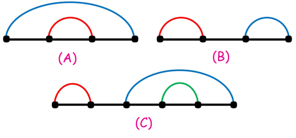
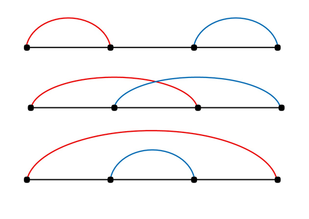
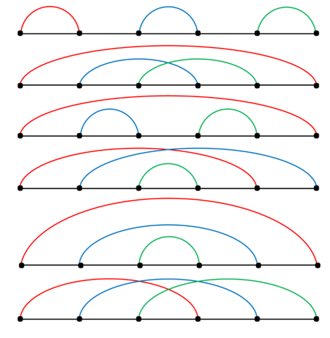

<h1 style='text-align: center;'> B. Kavi on Pairing Duty</h1>

<h5 style='text-align: center;'>time limit per test: 1 second</h5>
<h5 style='text-align: center;'>memory limit per test: 256 megabytes</h5>

Kavi has $2n$ points lying on the $OX$ axis, $i$-th of which is located at $x = i$.

Kavi considers all ways to split these $2n$ points into $n$ pairs. Among those, he is interested in good pairings, which are defined as follows:

Consider $n$ segments with ends at the points in correspondent pairs. The pairing is called good, if for every $2$ different segments $A$ and $B$ among those, at least one of the following holds:

* One of the segments $A$ and $B$ lies completely inside the other.
* $A$ and $B$ have the same length.

Consider the following example:

  $A$ is a good pairing since the red segment lies completely inside the blue segment.

$B$ is a good pairing since the red and the blue segment have the same length.

$C$ is not a good pairing since none of the red or blue segments lies inside the other, neither do they have the same size.

Kavi is interested in the number of good pairings, so he wants you to find it for him. As the result can be large, find this number modulo $998244353$.

Two pairings are called different, if some two points are in one pair in some pairing and in different pairs in another.

## Input

The single line of the input contains a single integer $n$ $(1\le n \le 10^6)$.

## Output

Print the number of good pairings modulo $998244353$.

## Examples

## Input


```

1

```
## Output


```

1
```
## Input


```

2

```
## Output


```

3
```
## Input


```

3

```
## Output


```

6
```
## Input


```

100

```
## Output


```

688750769
```
## Note

The good pairings for the second example are: 

  In the third example, the good pairings are: 

  

#### tags 

#1700 #combinatorics #dp #math 