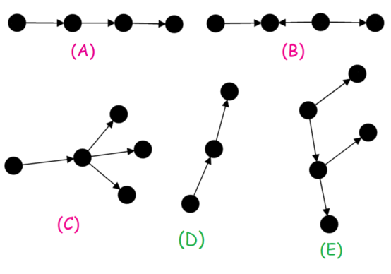

<h1 style='text-align: center;'> E. Mashtali and Hagh Trees</h1>

<h5 style='text-align: center;'>time limit per test: 1 second</h5>
<h5 style='text-align: center;'>memory limit per test: 256 megabytes</h5>

Today is Mashtali's birthday! He received a Hagh tree from Haj Davood as his birthday present!

A directed tree is called a Hagh tree iff: 

* The length of the longest directed path in it is exactly $n$.
* Every vertex has at most three edges attached to it independent of their orientation.
* Let's call vertices $u$ and $v$ friends if one of them has a directed path to the other. For every pair of vertices $u$ and $v$ that are not friends, there should exist a vertex $w$ that is friends with both $u$ and $v$ (a mutual friend).

After opening his gift, Mashtali found out that the labels on the vertices were gone.

Immediately, he asked himself: how many different unlabeled Hagh trees are there? That is, how many possible trees could he have received as his birthday present?

At the first glance, the number of such trees seemed to be infinite since there was no limit on the number of vertices; but then he solved the problem and proved that there's a finite number of unlabeled Hagh trees!

Amazed by this fact, he shared the task with you so that you could enjoy solving it as well. Since the answer can be rather large he asked you to find the number of different unlabeled Hagh trees modulo $998244353$.

Here two trees are considered different, if they are not isomorphic: if there is no way to map nodes of one tree to the second tree, so that edges are mapped to edges preserving the orientation.

Some examples for $n = 2$: 

  Directed trees $D$ and $E$ are Hagh. $C$ is not Hagh because it has a vertex with $4$ edges attached to it. $A$ and $B$ are not Hagh because their longest directed paths are not equal to $n$. Also in $B$ the leftmost and rightmost vertices are not friends neither do they have a mutual friend.

## Input

The first line of input contains a single integer $n$ $(1 \le n \le 10^6)$.

## Output

Print a single integer, the answer to Mashtali's task modulo $998244353$.

## Examples

## Input


```

1

```
## Output


```

5

```
## Input


```

2

```
## Output


```

31

```
## Input


```

344031

```
## Output


```

272040628

```
## Note

All the five Hagh trees for $n = 1$: 

  

#### tags 

#2900 #combinatorics #dp #trees 