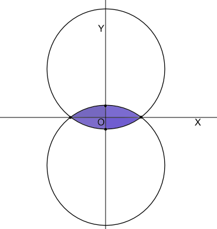

<h1 style='text-align: center;'> E. Martian Colony</h1>

<h5 style='text-align: center;'>time limit per test: 4 seconds</h5>
<h5 style='text-align: center;'>memory limit per test: 256 megabytes</h5>

The first ship with the Earth settlers landed on Mars. The colonists managed to build *n* necessary structures on the surface of the planet (which can be regarded as a plane, and the construction can be regarded as points on it). But one day the scanners recorded suspicious activity on the outskirts of the colony. It was decided to use the protective force field generating system to protect the colony against possible trouble.

The system works as follows: the surface contains a number of generators of the field (they can also be considered as points). The active range of each generator is a circle of radius *r* centered at the location of the generator (the boundary of the circle is also included in the range). After the system is activated, it stretches the protective force field only over the part of the surface, which is within the area of all generators' activity. That is, the protected part is the intersection of the generators' active ranges.

The number of generators available to the colonists is not limited, but the system of field generation consumes a lot of energy. More precisely, the energy consumption does not depend on the number of generators, but it is directly proportional to the area, which is protected by the field. Also, it is necessary that all the existing buildings are located within the protected area.

Determine the smallest possible area of the protected part of the surface containing all the buildings.

## Input

The first line contains two integers *n* and *r* (1 ≤ *n* ≤ 105, 1 ≤ *r* ≤ 50000) — the number of buildings and the active ranges of the generators, correspondingly.

Next *n* lines contains the buildings' coordinates. The *i* + 1-th (1 ≤ *i* ≤ *n*) line contains two real numbers with at most three digits after the decimal point *x**i* and *y**i* (|*x**i*|, |*y**i*| ≤ 50000) — coordinates of the *i*-th building. It is guaranteed that no two buildings are located at the same point, and no two different buildings are located closer than 1.

It is guaranteed that there exists a circle with radius *r* that contains all the buildings.

## Output

Print the single real number — the minimum area of the protected part containing all the buildings. The answer is accepted if absolute or relative error doesn't exceed 10- 4.

## Examples

## Input


```
3 5  
0.00 0.000  
0.0 8.00  
6 8.00  

```
## Output


```
78.5398163397  

```
## Input


```
4 1000  
0.0 0.0  
0 2.00  
2.00 2  
2.0 0.00  

```
## Output


```
4.0026666140  

```
## Input


```
4 5  
3.00 0.0  
-3 0.00  
0.000 1  
0.0 -1.00  

```
## Output


```
8.1750554397  

```
## Note

In the first sample the given radius equals the radius of the circle circumscribed around the given points. That's why the circle that corresponds to it is the sought area. The answer is 25π.

In the second sample the area nearly coincides with the square which has vertexes in the given points.

The area for the third sample is shown on the picture below.

  

#### tags 

#3000 #geometry 