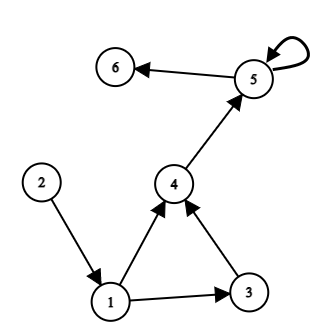

<h1 style='text-align: center;'> G. How Many Paths?</h1>

<h5 style='text-align: center;'>time limit per test: 4 seconds</h5>
<h5 style='text-align: center;'>memory limit per test: 512 megabytes</h5>

You are given a directed graph $G$ which can contain loops (edges from a vertex to itself). Multi-edges are absent in $G$ which means that for all ordered pairs $(u, v)$ exists at most one edge from $u$ to $v$. Vertices are numbered from $1$ to $n$.

A path from $u$ to $v$ is a sequence of edges such that:

* vertex $u$ is the start of the first edge in the path;
* vertex $v$ is the end of the last edge in the path;
* for all pairs of adjacent edges next edge starts at the vertex that the previous edge ends on.

We will assume that the empty sequence of edges is a path from $u$ to $u$.

For each vertex $v$ output one of four values:

* $0$, if there are no paths from $1$ to $v$;
* $1$, if there is only one path from $1$ to $v$;
* $2$, if there is more than one path from $1$ to $v$ and the number of paths is finite;
* $-1$, if the number of paths from $1$ to $v$ is infinite.

Let's look at the example shown in the figure.

  Then:

* the answer for vertex $1$ is $1$: there is only one path from $1$ to $1$ (path with length $0$);
* the answer for vertex $2$ is $0$: there are no paths from $1$ to $2$;
* the answer for vertex $3$ is $1$: there is only one path from $1$ to $3$ (it is the edge $(1, 3)$);
* the answer for vertex $4$ is $2$: there are more than one paths from $1$ to $4$ and the number of paths are finite (two paths: $[(1, 3), (3, 4)]$ and $[(1, 4)]$);
* the answer for vertex $5$ is $-1$: the number of paths from $1$ to $5$ is infinite (the loop can be used in a path many times);
* the answer for vertex $6$ is $-1$: the number of paths from $1$ to $6$ is infinite (the loop can be used in a path many times).
## Input

The first contains an integer $t$ ($1 \le t \le 10^4$) — the number of test cases in the input. Then $t$ test cases follow. Before each test case, there is an empty line.

The first line of the test case contains two integers $n$ and $m$ ($1 \le n \le 4 \cdot 10^5, 0 \le m \le 4 \cdot 10^5$) — numbers of vertices and edges in graph respectively. The next $m$ lines contain edges descriptions. Each line contains two integers $a_i$, $b_i$ ($1 \le a_i, b_i \le n$) — the start and the end of the $i$-th edge. The vertices of the graph are numbered from $1$ to $n$. The given graph can contain loops (it is possible that $a_i = b_i$), but cannot contain multi-edges (it is not possible that $a_i = a_j$ and $b_i = b_j$ for $i \ne j$).

The sum of $n$ over all test cases does not exceed $4 \cdot 10^5$. Similarly, the sum of $m$ over all test cases does not exceed $4 \cdot 10^5$.

## Output

## Output

 $t$ lines. The $i$-th line should contain an answer for the $i$-th test case: a sequence of $n$ integers from $-1$ to $2$.

## Example

## Input


```

5

6 7
1 4
1 3
3 4
4 5
2 1
5 5
5 6

1 0

3 3
1 2
2 3
3 1

5 0

4 4
1 2
2 3
1 4
4 3

```
## Output


```

1 0 1 2 -1 -1 
1 
-1 -1 -1 
1 0 0 0 0 
1 1 2 1 

```


#### tags 

#2100 #dfs_and_similar #dp #graphs #trees 