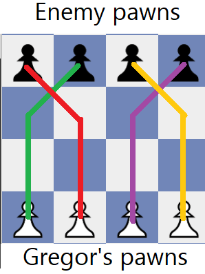

<h1 style='text-align: center;'> B. Gregor and the Pawn Game</h1>

<h5 style='text-align: center;'>time limit per test: 1 second</h5>
<h5 style='text-align: center;'>memory limit per test: 256 megabytes</h5>

There is a chessboard of size $n$ by $n$. The square in the $i$-th row from top and $j$-th column from the left is labelled $(i,j)$.

Currently, Gregor has some pawns in the $n$-th row. There are also enemy pawns in the $1$-st row. On one turn, Gregor moves one of his pawns. A pawn can move one square up (from $(i,j)$ to $(i-1,j)$) if there is no pawn in the destination square. Additionally, a pawn can move one square diagonally up (from $(i,j)$ to either $(i-1,j-1)$ or $(i-1,j+1)$) if and only if there is an enemy pawn in that square. The enemy pawn is also removed.

Gregor wants to know what is the maximum number of his pawns that can reach row $1$?

## Note

 that only Gregor takes turns in this game, and the enemy pawns never move. Also, when Gregor's pawn reaches row $1$, it is stuck and cannot make any further moves.

## Input

The first line of the input contains one integer $t$ ($1\le t\le 2\cdot 10^4$) — the number of test cases. Then $t$ test cases follow.

Each test case consists of three lines. The first line contains a single integer $n$ ($2\le n\le 2\cdot{10}^{5}$) — the size of the chessboard.

The second line consists of a string of binary digits of length $n$, where a $1$ in the $i$-th position corresponds to an enemy pawn in the $i$-th cell from the left, and $0$ corresponds to an empty cell.

The third line consists of a string of binary digits of length $n$, where a $1$ in the $i$-th position corresponds to a Gregor's pawn in the $i$-th cell from the left, and $0$ corresponds to an empty cell.

It is guaranteed that the sum of $n$ across all test cases is less than $2\cdot{10}^{5}$.

## Output

For each test case, print one integer: the maximum number of Gregor's pawns which can reach the $1$-st row.

## Example

## Input


```

4
3
000
111
4
1111
1111
3
010
010
5
11001
00000

```
## Output


```

3
4
0
0

```
## Note

In the first example, Gregor can simply advance all $3$ of his pawns forward. Thus, the answer is $3$.

In the second example, Gregor can guarantee that all $4$ of his pawns reach the enemy row, by following the colored paths as demonstrated in the diagram below. Remember, only Gregor takes turns in this "game"!

  In the third example, Gregor's only pawn is stuck behind the enemy pawn, and cannot reach the end.

In the fourth example, Gregor has no pawns, so the answer is clearly $0$.


#### tags 

#800 #dfs_and_similar #dp #flows #graph_matchings #graphs #greedy #implementation 