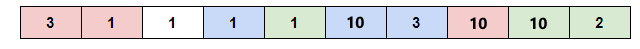

<h1 style='text-align: center;'> B2. Wonderful Coloring - 2</h1>

<h5 style='text-align: center;'>time limit per test: 2 seconds</h5>
<h5 style='text-align: center;'>memory limit per test: 256 megabytes</h5>

This problem is an extension of the problem "Wonderful Coloring - 1". It has quite many differences, so you should read this statement completely.

Recently, Paul and Mary have found a new favorite sequence of integers $a_1, a_2, \dots, a_n$. They want to paint it using pieces of chalk of $k$ colors. The coloring of a sequence is called wonderful if the following conditions are met:

1. each element of the sequence is either painted in one of $k$ colors or isn't painted;
2. each two elements which are painted in the same color are different (i. e. there's no two equal values painted in the same color);
3. let's calculate for each of $k$ colors the number of elements painted in the color — all calculated numbers must be equal;
4. the total number of painted elements of the sequence is the maximum among all colorings of the sequence which meet the first three conditions.

E. g. consider a sequence $a=[3, 1, 1, 1, 1, 10, 3, 10, 10, 2]$ and $k=3$. One of the wonderful colorings of the sequence is shown in the figure.

  The example of a wonderful coloring of the sequence $a=[3, 1, 1, 1, 1, 10, 3, 10, 10, 2]$ and $k=3$. ## Note

 that one of the elements isn't painted. Help Paul and Mary to find a wonderful coloring of a given sequence $a$.

## Input

The first line contains one integer $t$ ($1 \le t \le 10000$) — the number of test cases. Then $t$ test cases follow.

Each test case consists of two lines. The first one contains two integers $n$ and $k$ ($1 \le n \le 2\cdot10^5$, $1 \le k \le n$) — the length of a given sequence and the number of colors, respectively. The second one contains $n$ integers $a_1, a_2, \dots, a_n$ ($1 \le a_i \le n$).

It is guaranteed that the sum of $n$ over all test cases doesn't exceed $2 \cdot 10^5$.

## Output

## Output

 $t$ lines, each of them must contain a description of a wonderful coloring for the corresponding test case.

Each wonderful coloring must be printed as a sequence of $n$ integers $c_1, c_2, \dots, c_n$ ($0 \le c_i \le k$) separated by spaces where

* $c_i=0$, if $i$-th element isn't painted;
* $c_i>0$, if $i$-th element is painted in the $c_i$-th color.

Remember that you need to maximize the total count of painted elements for the wonderful coloring. If there are multiple solutions, print any one.

## Example

## Input


```

6
10 3
3 1 1 1 1 10 3 10 10 2
4 4
1 1 1 1
1 1
1
13 1
3 1 4 1 5 9 2 6 5 3 5 8 9
13 2
3 1 4 1 5 9 2 6 5 3 5 8 9
13 3
3 1 4 1 5 9 2 6 5 3 5 8 9

```
## Output


```

1 1 0 2 3 2 2 1 3 3
4 2 1 3
1
0 0 1 1 0 1 1 1 0 1 1 1 0
2 1 2 2 1 1 1 1 2 1 0 2 2
1 1 3 2 1 3 3 1 2 2 3 2 0

```
## Note

In the first test case, the answer is shown in the figure in the statement. The red color has number $1$, the blue color — $2$, the green — $3$.


#### tags 

#1400 #binary_search #constructive_algorithms #data_structures #greedy 