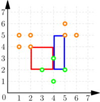

<h1 style='text-align: center;'> H. Guess the Perimeter</h1>

<h5 style='text-align: center;'>time limit per test: 1 second</h5>
<h5 style='text-align: center;'>memory limit per test: 256 megabytes</h5>

Let us call a point of the plane admissible if its coordinates are positive integers less than or equal to $200$.

There is an invisible rectangle such that: 

* its vertices are all admissible;
* its sides are parallel to the coordinate axes;
* its area is strictly positive.

 Your task is to guess the perimeter of this rectangle.In order to guess it, you may ask at most $4$ queries. 

In each query, you choose a nonempty subset of the admissible points and you are told how many of the chosen points are inside or on the boundary of the invisible rectangle.

## Interaction

To ask a query (of the kind described in the statement), you shall print two lines:

* In the first line print "? $k$" (without the quotes) where $k$ ($k\ge 1$) is the number of chosen points.
* In the second line print $2k$ integers $x_1,\, y_1,\, x_2,\, y_2,\, \dots,\, x_k,\, y_k$ ($1\le x_i,y_i\le 200$ for $i=1,2,\dots,k$) where $(x_1, y_1),\,(x_2, y_2),\,(x_3, y_3),\, \dots,\,(x_k, y_k)$ are the $k$ distinct admissible chosen points (the order of the points is not important).

 After this, you should read an integer — the number of chosen points that are inside or on the boundary of the invisible rectangle.When you have identified the perimeter $p$ of the invisible rectangle, you must print "! $p$" (without quotes) and terminate your program.

If you ask more than $4$ queries or if one of the queries is malformed, the interactor terminates immediately and your program receives verdict Wrong Answer.

The interactor may be adaptive (i.e., the hidden rectangle may not be chosen before the beginning of the interaction).

After printing a query do not forget to output end of line and flush the output. Otherwise, you will get Idleness limit exceeded. To do this, use: 

* fflush(stdout) or cout.flush() in C++;
* System.out.flush() in Java;
* flush(output) in Pascal;
* stdout.flush() in Python;
* see documentation for other languages.

Hacks

To hack a solution, use the following format.

The input has only one line, containing the $4$ integers $x_0$, $y_0$, $x_1$, $y_1$ ($1\le x_0<x_1\le 200$, $1\le y_0 < y_1 \le 200$) — $(x_0,y_0)$ is the bottom-left vertex of the hidden rectangle and $(x_1, y_1)$ is the top-right vertex of the hidden rectangle.

## Note

 that for hacks the interaction won't be adaptive.

## Examples

Input
```

13 5 123 80

```
Output
```


```
Input
```

2 2 4 4

```
Output
```


```
Input
```

1 1 200 200

```
Output
```


```
## Note

The following is an example of interaction for the first sample intended to show the format of the queries. $$ \begin{array}{l|l|l} \text{Query (contestant program)} & \text{Answer (interactor)} & \text{Explanation} \\\ \hline \mathtt{?\ 4} & & \text{We choose the $4$ vertices of} \\\ \mathtt{13\ 5\ 13\ 80\ 123\ 5\ 123\ 80} & \mathtt{4} &\text{the hidden rectangle.}\\\ \hline \mathtt{?\ 5} & & \text{We choose $4$ points just outside the hidden}\\\ \mathtt{100\ 4\ 100\ 81\ 12\ 40\ 124\ 40\ 50\ 50} & \mathtt{1}& \text{rectangle and also the point $(50,50)$.}\\\ \hline \mathtt{?\ 2} & & \text{We choose the points $(1, 1)$} \\\ \mathtt{200\ 200\ 1\ 1} & \mathtt{0} & \text{and $(200,200)$.}\\\ \hline \mathtt{!\ 370} & & \text{This is the correct perimeter.} \end{array} $$

For the second sample, a possible interaction is the following. $$ \begin{array}{l|l|l} \text{Query (contestant program)} & \text{Answer (interactor)} & \text{Explanation} \\\ \hline \mathtt{?\ 4} & & \text{We choose the points $(3, 2)$, $(4, 1)$,} \\\ \mathtt{3\ 2\ 4\ 1\ 5\ 2\ 4\ 3} & 2 & \text{$(5, 2)$ and $(4, 3)$.} \\\ \hline \mathtt{?\ 7} & & \text{We choose the points $(1, 4)$, $(2, 4)$,} \\\ \mathtt{1\ 4\ 2\ 4\ 1\ 5\ 2\ 5\ 5\ 5\ 5\ 6\ 6\ 5} & 1 & \text{$(1, 5)$, $(2, 5)$, $(5, 5)$, $(5, 6)$ and $(6, 5)$.} \\\ \hline \mathtt{!\ 8} & & \text{This is the correct perimeter.} \end{array} $$ The situation is shown in the following picture:

  The green points are the ones belonging to the first query, while the orange points are the ones belonging to the second query. One can see that there are exactly two rectangles consistent with the interactor's answers: 

* the rectangle of vertices $(2, 2)$ and $(4, 4)$, shown in red;
* the rectangle of vertices $(4, 2)$ and $(5, 5)$, shown in blue.

 Since both of these rectangles have perimeter $8$, this is the final answer.

#### tags 

#3300 #binary_search #interactive #number_theory 