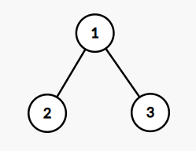

<h1 style='text-align: center;'> E. You</h1>

<h5 style='text-align: center;'>time limit per test: 5 seconds</h5>
<h5 style='text-align: center;'>memory limit per test: 256 megabytes</h5>

You are given a tree with $n$ nodes. As a reminder, a tree is a connected undirected graph without cycles.

Let $a_1, a_2, \ldots, a_n$ be a sequence of integers. Perform the following operation exactly $n$ times: 

* Select an unerased node $u$. Assign $a_u :=$ number of unerased nodes adjacent to $u$. Then, erase the node $u$ along with all edges that have it as an endpoint.

For each integer $k$ from $1$ to $n$, find the number, modulo $998\,244\,353$, of different sequences $a_1, a_2, \ldots, a_n$ that satisfy the following conditions:

* it is possible to obtain $a$ by performing the aforementioned operations exactly $n$ times in some order.
* $\operatorname{gcd}(a_1, a_2, \ldots, a_n) = k$. Here, $\operatorname{gcd}$ means the greatest common divisor of the elements in $a$.
## Input

The first line contains a single integer $t$ ($1 \le t \le 10\,000$)  — the number of test cases.

The first line of each test case contains a single integer $n$ ($2 \le n \le 10^5$).

Each of the next $n - 1$ lines contains two integers $u$ and $v$ ($1 \le u, v \le n$) indicating there is an edge between vertices $u$ and $v$. It is guaranteed that the given edges form a tree.

It is guaranteed that the sum of $n$ over all test cases doesn't exceed $3 \cdot 10^5$.

## Output

For each test case, print $n$ integers in a single line, where for each $k$ from $1$ to $n$, the $k$-th integer denotes the answer when $\operatorname{gcd}$ equals to $k$.

## Example

## Input


```

2
3
2 1
1 3
2
1 2

```
## Output


```

3 1 0
2 0

```
## Note

In the first test case, 

  * If we delete the nodes in order $1 \rightarrow 2 \rightarrow 3$ or $1 \rightarrow 3 \rightarrow 2$, then the obtained sequence will be $a = [2, 0, 0]$ which has $\operatorname{gcd}$ equals to $2$.
* If we delete the nodes in order $2 \rightarrow 1 \rightarrow 3$, then the obtained sequence will be $a = [1, 1, 0]$ which has $\operatorname{gcd}$ equals to $1$.
* If we delete the nodes in order $3 \rightarrow 1 \rightarrow 2$, then the obtained sequence will be $a = [1, 0, 1]$ which has $\operatorname{gcd}$ equals to $1$.
* If we delete the nodes in order $2 \rightarrow 3 \rightarrow 1$ or $3 \rightarrow 2 \rightarrow 1$, then the obtained sequence will be $a = [0, 1, 1]$ which has $\operatorname{gcd}$ equals to $1$.

## Note

 that here we are counting the number of different sequences, not the number of different orders of deleting nodes.


#### tags 

#2600 #dfs_and_similar #dp #math #number_theory 