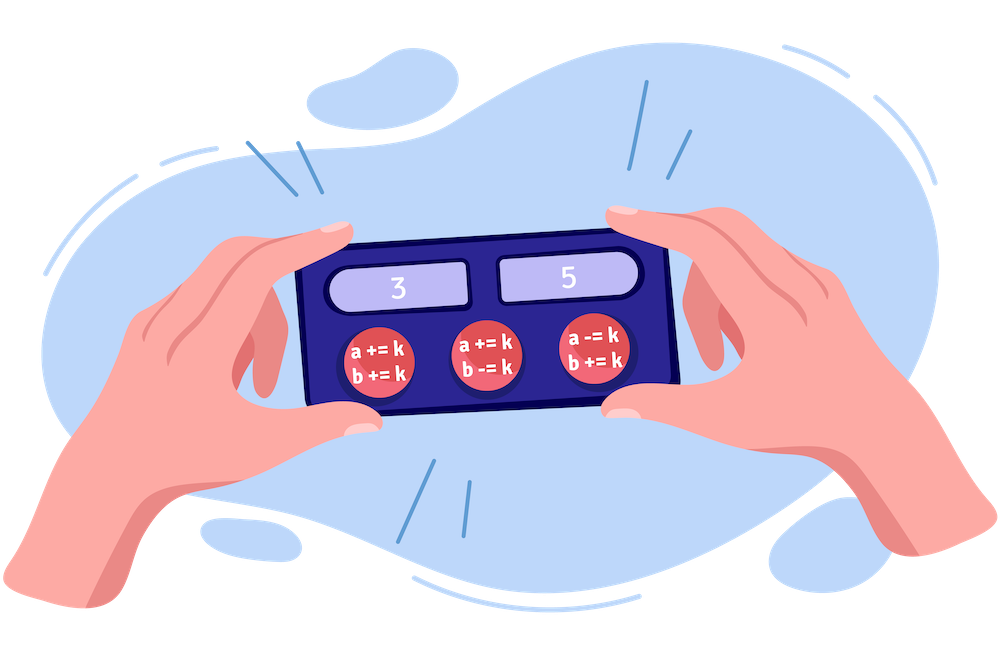

<h1 style='text-align: center;'> A. A Variety of Operations</h1>

<h5 style='text-align: center;'>time limit per test: 1 second</h5>
<h5 style='text-align: center;'>memory limit per test: 256 megabytes</h5>

  William has two numbers $a$ and $b$ initially both equal to zero. William mastered performing three different operations with them quickly. Before performing each operation some positive integer $k$ is picked, which is then used to perform one of the following operations: (note, that for each operation you can choose a new positive integer $k$)

1. add number $k$ to both $a$ and $b$, or
2. add number $k$ to $a$ and subtract $k$ from $b$, or
3. add number $k$ to $b$ and subtract $k$ from $a$.

## Note

 that after performing operations, numbers $a$ and $b$ may become negative as well.

William wants to find out the minimal number of operations he would have to perform to make $a$ equal to his favorite number $c$ and $b$ equal to his second favorite number $d$.

## Input

Each test contains multiple test cases. The first line contains the number of test cases $t$ ($1 \le t \le 10^4$). Description of the test cases follows.

The only line of each test case contains two integers $c$ and $d$ $(0 \le c, d \le 10^9)$, which are William's favorite numbers and which he wants $a$ and $b$ to be transformed into.

## Output

For each test case output a single number, which is the minimal number of operations which William would have to perform to make $a$ equal to $c$ and $b$ equal to $d$, or $-1$ if it is impossible to achieve this using the described operations.

## Example

## Input


```

6
1 2
3 5
5 3
6 6
8 0
0 0

```
## Output


```

-1
2
2
1
2
0

```
## Note

Let us demonstrate one of the suboptimal ways of getting a pair $(3, 5)$:

* Using an operation of the first type with $k=1$, the current pair would be equal to $(1, 1)$.
* Using an operation of the third type with $k=8$, the current pair would be equal to $(-7, 9)$.
* Using an operation of the second type with $k=7$, the current pair would be equal to $(0, 2)$.
* Using an operation of the first type with $k=3$, the current pair would be equal to $(3, 5)$.


#### tags 

#800 #math 