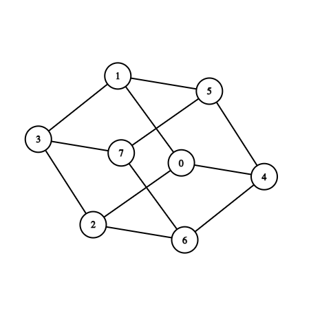
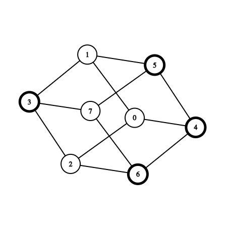

<h1 style='text-align: center;'> G. Gates to Another World</h1>

<h5 style='text-align: center;'>time limit per test: 4 seconds</h5>
<h5 style='text-align: center;'>memory limit per test: 1024 megabytes</h5>

  As mentioned previously William really likes playing video games. In one of his favorite games, the player character is in a universe where every planet is designated by a binary number from $0$ to $2^n - 1$. On each planet, there are gates that allow the player to move from planet $i$ to planet $j$ if the binary representations of $i$ and $j$ differ in exactly one bit.

William wants to test you and see how you can handle processing the following queries in this game universe:

* Destroy planets with numbers from $l$ to $r$ inclusively. These planets cannot be moved to anymore.
* Figure out if it is possible to reach planet $b$ from planet $a$ using some number of planetary gates. It is guaranteed that the planets $a$ and $b$ are not destroyed.
## Input

The first line contains two integers $n$, $m$ ($1 \leq n \leq 50$, $1 \leq m \leq 5 \cdot 10^4$), which are the number of bits in binary representation of each planets' designation and the number of queries, respectively.

Each of the next $m$ lines contains a query of two types:

block l r — query for destruction of planets with numbers from $l$ to $r$ inclusively ($0 \le l \le r < 2^n$). It's guaranteed that no planet will be destroyed twice.

ask a b — query for reachability between planets $a$ and $b$ ($0 \le a, b < 2^n$). It's guaranteed that planets $a$ and $b$ hasn't been destroyed yet.

## Output

For each query of type ask you must output "1" in a new line, if it is possible to reach planet $b$ from planet $a$ and "0" otherwise (without quotation marks).

## Examples

## Input


```

3 3
ask 0 7
block 3 6
ask 0 7

```
## Output


```

1
0

```
## Input


```

6 10
block 12 26
ask 44 63
block 32 46
ask 1 54
block 27 30
ask 10 31
ask 11 31
ask 49 31
block 31 31
ask 2 51

```
## Output


```

1
1
0
0
1
0

```
## Note

The first example test can be visualized in the following way:

  Response to a query ask 0 7 is positive.

Next after query block 3 6 the graph will look the following way (destroyed vertices are highlighted):

  Response to a query ask 0 7 is negative, since any path from vertex $0$ to vertex $7$ must go through one of the destroyed vertices.


#### tags 

#3300 #bitmasks #data_structures #dsu #two_pointers 