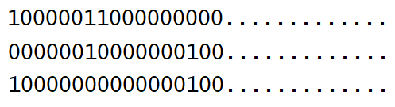
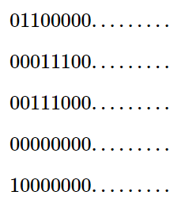

<h1 style='text-align: center;'> D. Ezzat and Grid</h1>

<h5 style='text-align: center;'>time limit per test: 2.5 seconds</h5>
<h5 style='text-align: center;'>memory limit per test: 256 megabytes</h5>

Moamen was drawing a grid of $n$ rows and $10^9$ columns containing only digits $0$ and $1$. Ezzat noticed what Moamen was drawing and became interested in the minimum number of rows one needs to remove to make the grid beautiful.

A grid is beautiful if and only if for every two consecutive rows there is at least one column containing $1$ in these two rows.

Ezzat will give you the number of rows $n$, and $m$ segments of the grid that contain digits $1$. Every segment is represented with three integers $i$, $l$, and $r$, where $i$ represents the row number, and $l$ and $r$ represent the first and the last column of the segment in that row.

For example, if $n = 3$, $m = 6$, and the segments are $(1,1,1)$, $(1,7,8)$, $(2,7,7)$, $(2,15,15)$, $(3,1,1)$, $(3,15,15)$, then the grid is:

  Your task is to tell Ezzat the minimum number of rows that should be removed to make the grid beautiful.

## Input

The first line contains two integers $n$ and $m$ ($1 \le n, m \le 3\cdot10^5$).

Each of the next $m$ lines contains three integers $i$, $l$, and $r$ ($1 \le i \le n$, $1 \le l \le r \le 10^9$). Each of these $m$ lines means that row number $i$ contains digits $1$ in columns from $l$ to $r$, inclusive.

## Note

 that the segments may overlap.

## Output

In the first line, print a single integer $k$ — the minimum number of rows that should be removed.

In the second line print $k$ distinct integers $r_1, r_2, \ldots, r_k$, representing the rows that should be removed ($1 \le r_i \le n$), in any order.

If there are multiple answers, print any.

## Examples

## Input


```

3 6
1 1 1
1 7 8
2 7 7
2 15 15
3 1 1
3 15 15

```
## Output


```

0

```
## Input


```

5 4
1 2 3
2 4 6
3 3 5
5 1 1

```
## Output


```

3
2 4 5
```
## Note

In the first test case, the grid is the one explained in the problem statement. The grid has the following properties: 

1. The $1$-st row and the $2$-nd row have a common $1$ in the column $7$.
2. The $2$-nd row and the $3$-rd row have a common $1$ in the column $15$.

 As a result, this grid is beautiful and we do not need to remove any row.In the second test case, the given grid is as follows: 

  

#### tags 

#2200 #data_structures #dp #greedy 