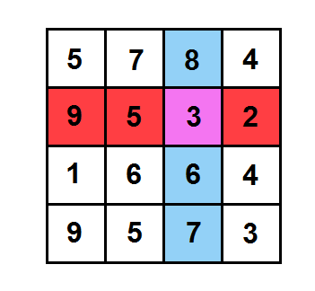

<h1 style='text-align: center;'> A. Game Outcome</h1>

<h5 style='text-align: center;'>time limit per test: 2 seconds</h5>
<h5 style='text-align: center;'>memory limit per test: 256 megabytes</h5>

Sherlock Holmes and Dr. Watson played some game on a checkered board *n* × *n* in size. During the game they put numbers on the board's squares by some tricky rules we don't know. However, the game is now over and each square of the board contains exactly one number. To understand who has won, they need to count the number of winning squares. To determine if the particular square is winning you should do the following. Calculate the sum of all numbers on the squares that share this column (including the given square) and separately calculate the sum of all numbers on the squares that share this row (including the given square). A square is considered winning if the sum of the column numbers is strictly greater than the sum of the row numbers.

For instance, lets game was ended like is shown in the picture. Then the purple cell is winning, because the sum of its column numbers equals 8 + 3 + 6 + 7 = 24, sum of its row numbers equals 9 + 5 + 3 + 2 = 19, and 24 > 19.

## Input

The first line contains an integer *n* (1 ≤ *n* ≤ 30). Each of the following *n* lines contain *n* space-separated integers. The *j*-th number on the *i*-th line represents the number on the square that belongs to the *j*-th column and the *i*-th row on the board. All number on the board are integers from 1 to 100.

## Output

Print the single number — the number of the winning squares.

## Examples

## Input


```
1  
1  

```
## Output


```
0  

```
## Input


```
2  
1 2  
3 4  

```
## Output


```
2  

```
## Input


```
4  
5 7 8 4  
9 5 3 2  
1 6 6 4  
9 5 7 3  

```
## Output


```
6  

```
## Note

In the first example two upper squares are winning.

In the third example three left squares in the both middle rows are winning:


```
5 7 8 4  
9 5 3 2  
1 6 6 4  
9 5 7 3  

```


#### tags 

#800 #brute_force 