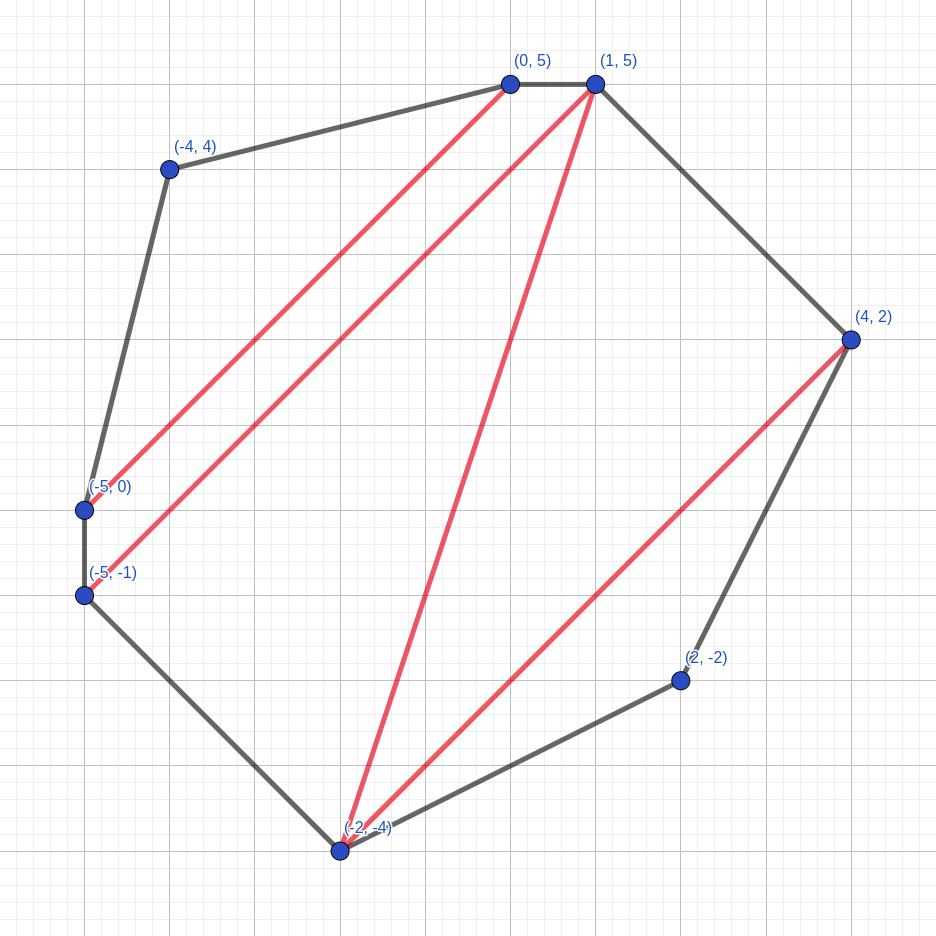
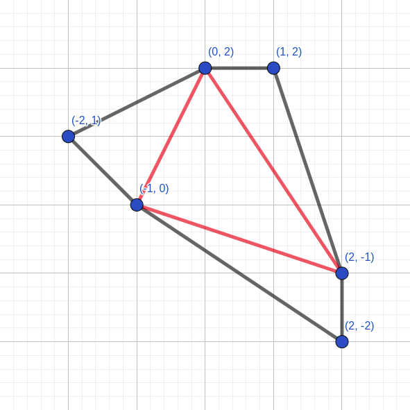

<h1 style='text-align: center;'> E. Polygon</h1>

<h5 style='text-align: center;'>time limit per test: 3 seconds</h5>
<h5 style='text-align: center;'>memory limit per test: 256 megabytes</h5>

You are given a strictly convex polygon with $n$ vertices.

You will make $k$ cuts that meet the following conditions: 

* each cut is a segment that connects two different nonadjacent vertices;
* two cuts can intersect only at vertices of the polygon.

Your task is to maximize the area of the smallest region that will be formed by the polygon and those $k$ cuts.

## Input

The first line contains two integers $n$, $k$ ($3 \le n \le 200$, $0 \le k \le n-3$).

The following $n$ lines describe vertices of the polygon in anticlockwise direction. The $i$-th line contains two integers $x_i$, $y_i$ ($|x_i|, |y_i| \le 10^8$) — the coordinates of the $i$-th vertex.

It is guaranteed that the polygon is convex and that no two adjacent sides are parallel.

## Output

Print one integer: the maximum possible area of the smallest region after making $k$ cuts multiplied by $2$.

## Examples

## Input


```

8 4
-2 -4
2 -2
4 2
1 5
0 5
-4 4
-5 0
-5 -1

```
## Output


```

11

```
## Input


```

6 3
2 -2
2 -1
1 2
0 2
-2 1
-1 0

```
## Output


```

3

```
## Note

In the first example, it's optimal to make cuts between the following pairs of vertices: 

* $(-2, -4)$ and $(4, 2)$,
* $(-2, -4)$ and $(1, 5)$,
* $(-5, -1)$ and $(1, 5)$,
* $(-5, 0)$ and $(0, 5)$.

   Points $(-5, -1)$, $(1, 5)$, $(0, 5)$, $(-5, 0)$ determine the smallest region with double area of $11$. In the second example, it's optimal to make cuts between the following pairs of vertices: 

* $(2, -1)$ and $(0, 2)$,
* $(2, -1)$ and $(1, 0)$,
* $(-1, 0)$ and $(0, 2)$.

   Points $(2, -2)$, $(2, -1)$, $(-1, 0)$ determine one of the smallest regions with double area of $3$. 

#### tags 

#3000 #binary_search #dp #geometry 