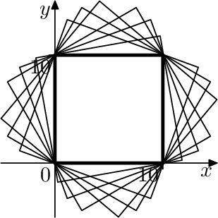
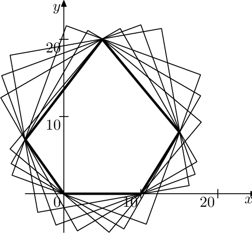

<h1 style='text-align: center;'> F. Framing Pictures</h1>

<h5 style='text-align: center;'>time limit per test: 2 seconds</h5>
<h5 style='text-align: center;'>memory limit per test: 1024 megabytes</h5>

Life has been discovered on Venus! What is more, the life forms appear to be convex polygons. An international consortium is designing a probe to send to Venus to take pictures, but they need to estimate the bandwidth needed to send back pictures.

When the probe takes a picture of a life form and wishes to send it back to Earth, the bandwidth required is proportional to the area of the bounding box (in other words, the smallest axis-aligned rectangle that contains the life-form). The shape and size of the life forms are known, but the orientation relative to the camera is random. You must thus determine the expected (average) area of the bounding box across all orientations.

## Input

The input describes the shape of a life form as a convex polygon in two dimensions.

The first line of input contains an integer $n$ ($3 \le n \le 200\,000$) — the number of vertices. The remaining $n$ lines each contain two integers $x$ and $y$ ($-10^9 \le x, y \le 10^9$) — the coordinates of a vertex. The vertices are given in counterclockwise order, and no three vertices lie on a straight line.

## Output

## Output

 a single line containing the expected area of the bounding box of the polygon. Your answer should have an absolute or relative error of at most $10^{-6}$.

## Examples

## Input


```

4
0 0
10 0
10 10
0 10

```
## Output


```

163.661977237

```
## Input


```

5
0 0
10 0
15 8
5 20
-5 7

```
## Output


```

365.666028588

```
## Note

The pictures show example life forms and various camera orientations. 

       

#### tags 

#2900 #geometry 