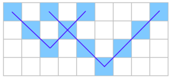

<h1 style='text-align: center;'> C. Ticks</h1>

<h5 style='text-align: center;'>time limit per test: 2 seconds</h5>
<h5 style='text-align: center;'>memory limit per test: 256 megabytes</h5>

Casimir has a rectangular piece of paper with a checkered field of size $n \times m$. Initially, all cells of the field are white.

Let us denote the cell with coordinates $i$ vertically and $j$ horizontally by $(i, j)$. The upper left cell will be referred to as $(1, 1)$ and the lower right cell as $(n, m)$.

Casimir draws ticks of different sizes on the field. A tick of size $d$ ($d > 0$) with its center in cell $(i, j)$ is drawn as follows: 

1. First, the center cell $(i, j)$ is painted black.
2. Then exactly $d$ cells on the top-left diagonally to the center and exactly $d$ cells on the top-right diagonally to the center are also painted black.
3. That is all the cells with coordinates $(i - h, j \pm h)$ for all $h$ between $0$ and $d$ are painted. In particular, a tick consists of $2d + 1$ black cells.

An already painted cell will remain black if painted again. Below you can find an example of the $4 \times 9$ box, with two ticks of sizes $2$ and $3$.

  You are given a description of a checkered field of size $n \times m$. Casimir claims that this field came about after he drew some (possibly $0$) ticks on it. The ticks could be of different sizes, but the size of each tick is at least $k$ (that is, $d \ge k$ for all the ticks).

Determine whether this field can indeed be obtained by drawing some (possibly none) ticks of sizes $d \ge k$ or not.

## Input

The first line contains an integer $t$ ($1 \leq t \leq 100$) — the number test cases.

The following lines contain the descriptions of the test cases. 

The first line of the test case description contains the integers $n$, $m$, and $k$ ($1 \le k \le n \le 10$; $1 \le m \le 19$) — the field size and the minimum size of the ticks that Casimir drew. The following $n$ lines describe the field: each line consists of $m$ characters either being '.' if the corresponding cell is not yet painted or '*' otherwise.

## Output

Print $t$ lines, each line containing the answer to the corresponding test case. The answer to a test case should be YES if the given field can be obtained by drawing ticks of at least the given size and NO otherwise.

You may print every letter in any case you want (so, for example, the strings yEs, yes, Yes, and YES will all be recognized as positive answers).

## Example

## Input


```

8
2 3 1
*.*
...
4 9 2
*.*.*...*
.*.*...*.
..*.*.*..
.....*...
4 4 1
*.*.
****
.**.
....
5 5 1
.....
*...*
.*.*.
..*.*
...*.
5 5 2
.....
*...*
.*.*.
..*.*
...*.
4 7 1
*.....*
.....*.
..*.*..
...*...
3 3 1
***
***
***
3 5 1
*...*
.***.
.**..

```
## Output


```

NO
YES
YES
YES
NO
NO
NO
NO

```
## Note

The first sample test case consists of two asterisks neither of which can be independent ticks since ticks of size $0$ don't exist.

The second sample test case is already described in the statement (check the picture in the statement). This field can be obtained by drawing ticks of sizes $2$ and $3$, as shown in the figure.

The field in the third sample test case corresponds to three ticks of size $1$. Their center cells are marked with $\color{blue}{\text{blue}}$, $\color{red}{\text{red}}$ and $\color{green}{\text{green}}$ colors: 

| *.*. |
| --- |
| *$\color{blue}{\textbf{*}}$** |
| .$\color{green}{\textbf{*}}\color{red}{\textbf{*}}$. |
| .... |


The field in the fourth sample test case could have been obtained by drawing two ticks of sizes $1$ and $2$. Their vertices are marked below with $\color{blue}{\text{blue}}$ and $\color{red}{\text{red}}$ colors respectively: 

| ..... |
| --- |
| *...* |
| .*.*. |
| ..$\color{red}{\textbf{*}}$.* |
| ...$\color{blue}{\textbf{*}}$. |


The field in the fifth sample test case can not be obtained because $k = 2$, and the last asterisk in the fourth row from the top with coordinates $(4, 5)$ can only be a part of a tick of size $1$.

The field in the sixth sample test case can not be obtained because the top left asterisk $(1, 1)$ can't be an independent tick, since the sizes of the ticks must be positive, and cannot be part of a tick with the center cell in the last row, since it is separated from it by a gap (a point, '.') in $(2, 2)$.

In the seventh sample test case, similarly, the field can not be obtained by the described process because the asterisks with coordinates $(1, 2)$ (second cell in the first row), $(3, 1)$ and $(3, 3)$ (leftmost and rightmost cells in the bottom) can not be parts of any ticks.


#### tags 

#1500 #greedy #implementation 