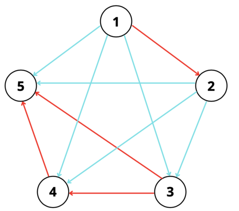
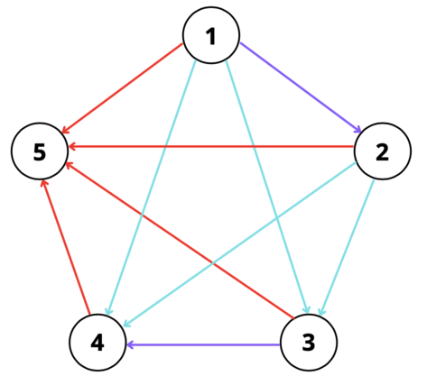

<h1 style='text-align: center;'> F. Defender of Childhood Dreams</h1>

<h5 style='text-align: center;'>time limit per test: 3 seconds</h5>
<h5 style='text-align: center;'>memory limit per test: 512 megabytes</h5>

Even if you just leave them be, they will fall to pieces all by themselves. So, someone has to protect them, right?

You find yourself playing with Teucer again in the city of Liyue. As you take the eccentric little kid around, you notice something interesting about the structure of the city.

Liyue can be represented as a directed graph containing $n$ nodes. Nodes are labeled from $1$ to $n$. There is a directed edge from node $a$ to node $b$ if and only if $a < b$.

A path between nodes $a$ and $b$ is defined as a sequence of edges such that you can start at $a$, travel along all of these edges in the corresponding direction, and end at $b$. The length of a path is defined by the number of edges. A rainbow path of length $x$ is defined as a path in the graph such that there exists at least 2 distinct colors among the set of $x$ edges.

Teucer's favorite number is $k$. You are curious about the following scenario: If you were to label each edge with a color, what is the minimum number of colors needed to ensure that all paths of length $k$ or longer are rainbow paths?

Teucer wants to surprise his older brother with a map of Liyue. He also wants to know a valid coloring of edges that uses the minimum number of colors. Please help him with this task!

## Input

The only line of input contains two integers $n$ and $k$ ($2 \leq k < n \leq 1000$). 

## Output

On the first line, output $c$, the minimum colors you need to satisfy the above requirements.

On the second line, print a valid edge coloring as an array of $\frac{n(n-1)}{2}$ integers ranging from $1$ to $c$. Exactly $c$ distinct colors should exist in the construction. Print the edges in increasing order by the start node first, then by the second node.

For example, if $n=4$, the edge colors will correspond to this order of edges: ($1$, $2$), ($1$, $3$), ($1$, $4$), ($2$, $3$), ($2$, $4$), ($3$, $4$)

## Examples

## Input


```

5 3

```
## Output


```

2
1 2 2 2 2 2 2 1 1 1

```
## Input


```

5 2

```
## Output


```

3
3 2 2 1 2 2 1 3 1 1 

```
## Input


```

8 7

```
## Output


```

2
2 2 2 2 2 2 2 1 1 1 1 1 1 1 1 1 1 1 1 1 1 1 1 1 1 1 1 1

```
## Input


```

3 2

```
## Output


```

2
1 2 2 

```
## Note

The corresponding construction for the first test case looks like this: 

   It is impossible to satisfy the constraints with less than $2$ colors.The corresponding construction for the second test case looks like this: 

   One can show there exists no construction using less than $3$ colors.

#### tags 

#2500 #bitmasks #constructive_algorithms #divide_and_conquer 