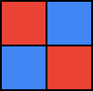
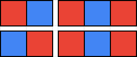
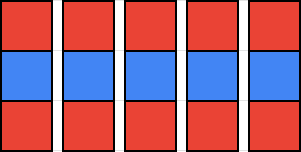

<h1 style='text-align: center;'> B. Coloring Rectangles</h1>

<h5 style='text-align: center;'>time limit per test: 1 second</h5>
<h5 style='text-align: center;'>memory limit per test: 256 megabytes</h5>

David was given a red checkered rectangle of size $n \times m$. But he doesn't like it. So David cuts the original or any other rectangle piece obtained during the cutting into two new pieces along the grid lines. He can do this operation as many times as he wants.

As a result, he will get a set of rectangles. Rectangles $1 \times 1$ are forbidden.

David also knows how to paint the cells blue. He wants each rectangle from the resulting set of pieces to be colored such that any pair of adjacent cells by side (from the same piece) have different colors.

What is the minimum number of cells David will have to paint?

## Input

The first line contains a single integer $t$ ($1 \leq t \leq 10^3$) — the number of test cases. The next lines contain descriptions of test cases.

The only line of each test case contains two integers $n$, $m$ ($1 \leq n, m \leq 3 \cdot 10^4$, $n \cdot m \geq 2$).

## Output

For each test case print a single integer — the minimum number of cells David will have to paint blue.

## Example

## Input


```

4
1 3
2 2
2 5
3 5

```
## Output


```

1
2
4
5

```
## Note

The following pictures show how the initial rectangle can be split and cells colored blue.

In the first test case:

  In the second test case:

  In the third test case:

  In the fourth test case:

  

#### tags 

#1000 #greedy #math 