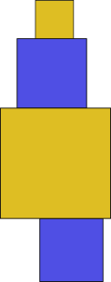

<h1 style='text-align: center;'> E. Zebra Tower</h1>

<h5 style='text-align: center;'>time limit per test: 1.5 seconds</h5>
<h5 style='text-align: center;'>memory limit per test: 256 megabytes</h5>

Little Janet likes playing with cubes. Actually, she likes to play with anything whatsoever, cubes or tesseracts, as long as they are multicolored. Each cube is described by two parameters — color *c**i* and size *s**i*. A Zebra Tower is a tower that consists of cubes of exactly two colors. Besides, the colors of the cubes in the tower must alternate (colors of adjacent cubes must differ). The Zebra Tower should have at least two cubes. There are no other limitations. The figure below shows an example of a Zebra Tower.

  A Zebra Tower's height is the sum of sizes of all cubes that form the tower. Help little Janet build the Zebra Tower of the maximum possible height, using the available cubes.

## Input

The first line contains an integer *n* (2 ≤ *n* ≤ 105) — the number of cubes. Next *n* lines contain the descriptions of the cubes, one description per line. A cube description consists of two space-separated integers *c**i* and *s**i* (1 ≤ *c**i*, *s**i* ≤ 109) — the *i*-th cube's color and size, correspondingly. It is guaranteed that there are at least two cubes of different colors.

## Output

Print the description of the Zebra Tower of the maximum height in the following form. In the first line print the tower's height, in the second line print the number of cubes that form the tower, and in the third line print the space-separated indices of cubes in the order in which they follow in the tower from the bottom to the top. Assume that the cubes are numbered from 1 to *n* in the order in which they were given in the input.

If there are several existing Zebra Towers with maximum heights, it is allowed to print any of them. 

Please do not use the %lld specificator to read or write 64-bit integers in С++. It is preferred to use the cin, cout streams or the %I64d specificator.

## Examples

## Input


```
4  
1 2  
1 3  
2 4  
3 3  

```
## Output


```
9  
3  
2 3 1   

```
## Input


```
2  
1 1  
2 1  

```
## Output


```
2  
2  
2 1   

```


#### tags 

#1700 #*special #data_structures #greedy #sortings 