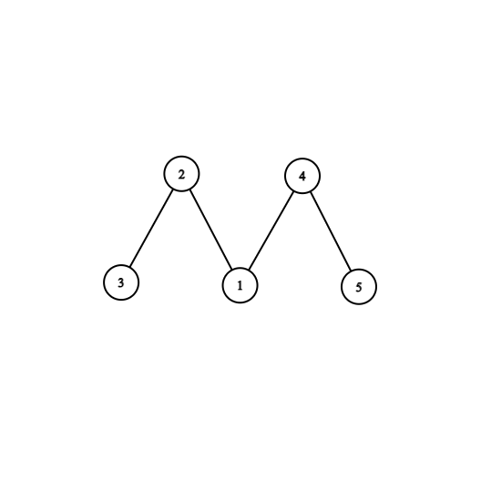

<h1 style='text-align: center;'> C. Bakry and Partitioning</h1>

<h5 style='text-align: center;'>time limit per test: 1 second</h5>
<h5 style='text-align: center;'>memory limit per test: 256 megabytes</h5>

Bakry faced a problem, but since he's lazy to solve it, he asks for your help.

You are given a tree of $n$ nodes, the $i$-th node has value $a_i$ assigned to it for each $i$ from $1$ to $n$. As a reminder, a tree on $n$ nodes is a connected graph with $n-1$ edges.

You want to delete at least $1$, but at most $k-1$ edges from the tree, so that the following condition would hold:

* For every connected component calculate the [bitwise XOR](https://en.wikipedia.org/wiki/Bitwise_operation#XOR) of the values of the nodes in it. Then, these values have to be the same for all connected components.

Is it possible to achieve this condition?

## Input

Each test contains multiple test cases. The first line contains the number of test cases $t$ $(1 \leq t \leq 5 \cdot 10^4)$. Description of the test cases follows.

The first line of each test case contains two integers $n$ and $k$ $(2 \leq k \leq n \leq 10^5)$.

The second line of each test case contains $n$ integers $a_1, a_2, ..., a_n$ $(1 \leq a_i \leq 10^9)$.

The $i$-th of the next $n-1$ lines contains two integers $u_i$ and $v_i$ ($1 \leq u_i, v_i \leq n$, $u_i\neq v_i$), which means that there's an edge between nodes $u_i$ and $v_i$.

It is guaranteed that the given graph is a tree.

It is guaranteed that the sum of $n$ over all test cases doesn't exceed $2 \cdot 10^5$.

## Output

For each test case, you should output a single string. If you can delete the edges according to the conditions written above, output "YES" (without quotes). Otherwise, output "NO" (without quotes).

You can print each letter of "YES" and "NO" in any case (upper or lower).

## Example

## Input


```

5
2 2
1 3
1 2
5 5
3 3 3 3 3
1 2
2 3
1 4
4 5
5 2
1 7 2 3 5
1 2
2 3
1 4
4 5
5 3
1 6 4 1 2
1 2
2 3
1 4
4 5
3 3
1 7 4
1 2
2 3

```
## Output


```

NO
YES
NO
YES
NO

```
## Note

It can be shown that the objection is not achievable for first, third, and fifth test cases.

In the second test case, you can just remove all the edges. There will be $5$ connected components, each containing only one node with value $3$, so the bitwise XORs will be $3$ for all of them.

In the fourth test case, this is the tree: .

You can remove an edge $(4,5)$

The bitwise XOR of the first component will be, $a_1 \oplus a_2 \oplus a_3 \oplus a_4 = 1 \oplus 6 \oplus 4 \oplus 1 = 2$ (where $\oplus$ denotes the bitwise XOR). 

The bitwise XOR of the second component will be, $a_5 = 2$. 


#### tags 

#1700 #bitmasks #constructive_algorithms #dfs_and_similar #dp #graphs #trees 