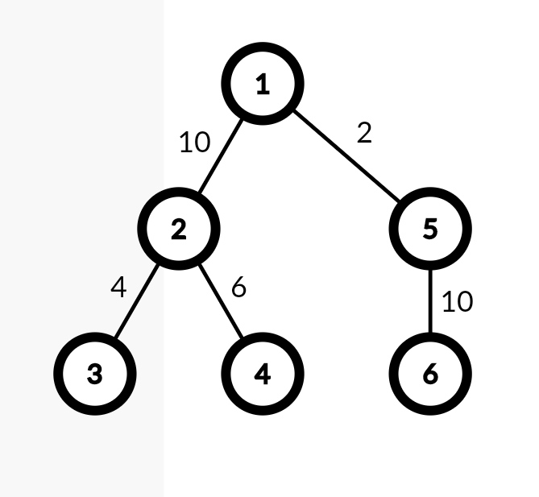

<h1 style='text-align: center;'> D. Hemose in ICPC ?</h1>

<h5 style='text-align: center;'>time limit per test: 1 second</h5>
<h5 style='text-align: center;'>memory limit per test: 256 megabytes</h5>

This is an interactive problem!

In the last regional contest Hemose, ZeyadKhattab and YahiaSherif — members of the team Carpe Diem — did not qualify to ICPC because of some unknown reasons. Hemose was very sad and had a bad day after the contest, but ZeyadKhattab is very wise and knows Hemose very well, and does not want to see him sad.

Zeyad knows that Hemose loves tree problems, so he gave him a tree problem with a very special device.

Hemose has a weighted tree with $n$ nodes and $n-1$ edges. Unfortunately, Hemose doesn't remember the weights of edges.

Let's define $Dist(u, v)$ for $u\neq v$ as the greatest common divisor of the weights of all edges on the path from node $u$ to node $v$.

Hemose has a special device. Hemose can give the device a set of nodes, and the device will return the largest $Dist$ between any two nodes from the set. More formally, if Hemose gives the device a set $S$ of nodes, the device will return the largest value of $Dist(u, v)$ over all pairs $(u, v)$ with $u$, $v$ $\in$ $S$ and $u \neq v$.

Hemose can use this Device at most $12$ times, and wants to find any two distinct nodes $a$, $b$, such that $Dist(a, b)$ is maximum possible. Can you help him?

## Interaction

Begin the interaction from reading a single integer $n$ ($2 \le n \le 10^3$) — the number of nodes in the tree.

Next, read $n-1$ lines. 

The $i$-th of the next $n-1$ lines contains two integers $u_i$ and $v_i$ ($1 \leq u_i, v_i \leq n$, $u_i\neq v_i$), which means that there's an edge between nodes $u_i$ and $v_i$.

It's guaranteed that weights of edges were $\leq 10^9$.

It is guaranteed that the given graph is a tree.

Now you may begin asking queries. To ask a query about a set of $k$ nodes $v_1, v_2, \ldots, v_k$ ($2 \le k \le n$, $1 \le v_i \le n$, all $v_i$ are distinct), output:

 ? $k$ $v_1$ $v_2$ $\ldots$ $v_k$

You will then receive an integer $x$, the largest $Dist(v_i, v_j)$ over $1 \le i, j \le k$ with $i \neq j$.

When you have found $a$ and $b$ ($1 \le a, b \le n)$, $a\neq b$) such that $Dist(a, b)$ is the maximum possible, print the answer in the following format: 

! $a$ $b$ 

Outputting answer doesn't count towards the limit of $12$ queries.

If there are several pairs $(a, b)$ with the same largest $Dist(a, b)$, you can output any.

After printing a query do not forget to output the end of line and flush the output. Otherwise, you will get Idleness limit exceeded. To do this, use:

* fflush(stdout) or cout.flush() in C++;
* System.out.flush() in Java;
* flush(output) in Pascal;
* stdout.flush() in Python;
* see the documentation for other languages.

Hacks

To hack a solution, use the following format.

The first line should contain a single integer $n$ $(2 \leq n \le 10^3)$ — the number of nodes.

The $i$-th of the next $n-1$ lines should contain three integers $u_i$, $v_i$, $w_i$ ($1 \le u_i, v_i \le n$, $u_i\ne v_i$, $1 \le w \le 10^9$), which means that there's an edge between nodes $u_i$ and $v_i$ with weight $w_i$.

These $n-1$ edges must form a tree.

## Example

Input
```

6
1 2
2 3
2 4
1 5
5 6

10

2

10
```
Output
```

? 6 1 2 3 4 5 6

? 3 3 1 5

? 2 1 2

! 1 2
```
## Note

The tree in the first sample:




#### tags 

#2300 #binary_search #dfs_and_similar #implementation #interactive #math #number_theory #trees 