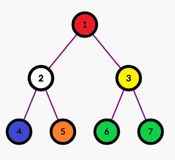

<h1 style='text-align: center;'> E2. Rubik's Cube Coloring (hard version)</h1>

<h5 style='text-align: center;'>time limit per test: 3 seconds</h5>
<h5 style='text-align: center;'>memory limit per test: 256 megabytes</h5>

It is the hard version of the problem. The difference is that in this version, there are nodes with already chosen colors.

Theofanis is starving, and he wants to eat his favorite food, sheftalia. However, he should first finish his homework. Can you help him with this problem?

You have a perfect binary tree of $2^k - 1$ nodes — a binary tree where all vertices $i$ from $1$ to $2^{k - 1} - 1$ have exactly two children: vertices $2i$ and $2i + 1$. Vertices from $2^{k - 1}$ to $2^k - 1$ don't have any children. You want to color its vertices with the $6$ Rubik's cube colors (White, Green, Red, Blue, Orange and Yellow).

Let's call a coloring good when all edges connect nodes with colors that are neighboring sides in the Rubik's cube.

 

|  |  |
| --- | --- |

 A picture of Rubik's cube and its 2D map. More formally: 

* a white node can not be neighboring with white and yellow nodes;
* a yellow node can not be neighboring with white and yellow nodes;
* a green node can not be neighboring with green and blue nodes;
* a blue node can not be neighboring with green and blue nodes;
* a red node can not be neighboring with red and orange nodes;
* an orange node can not be neighboring with red and orange nodes;

However, there are $n$ special nodes in the tree, colors of which are already chosen.

You want to calculate the number of the good colorings of the binary tree. Two colorings are considered different if at least one node is colored with a different color.

The answer may be too large, so output the answer modulo $10^9+7$.

## Input

The first line contains the integers $k$ ($1 \le k \le 60$) — the number of levels in the perfect binary tree you need to color.

The second line contains the integer $n$ ($1 \le n \le \min(2^k - 1, 2000)$) — the number of nodes, colors of which are already chosen.

The next $n$ lines contains integer $v$ ($1 \le v \le 2^k - 1$) and string $s$ — the index of the node and the color of the node ($s$ is one of the white, yellow, green, blue, red and orange).

It is guaranteed that each node $v$ appears in the input at most once.

## Output

Print one integer — the number of the different colorings modulo $10^9+7$.

## Examples

## Input


```

3
2
5 orange
2 white

```
## Output


```

1024

```
## Input


```

2
2
1 white
2 white

```
## Output


```

0

```
## Input


```

10
3
1 blue
4 red
5 orange

```
## Output


```

328925088

```
## Note

In the picture below, you can see one of the correct colorings of the first test example.

  

#### tags 

#2300 #brute_force #dp #implementation #math #trees 