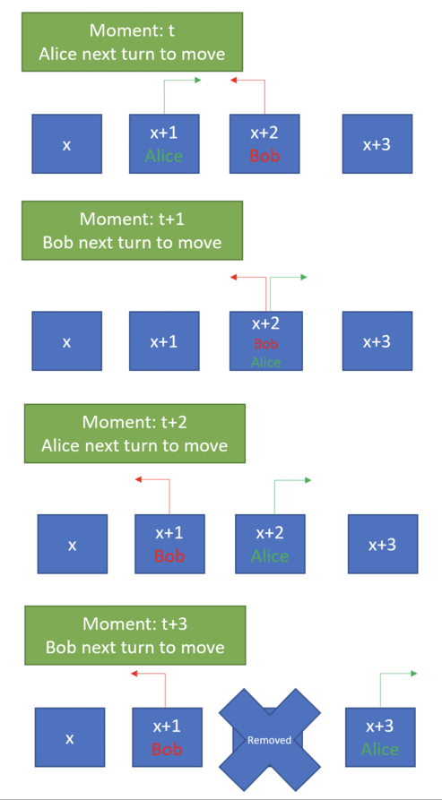

<h1 style='text-align: center;'> B. Restaurant Game</h1>

<h5 style='text-align: center;'>time limit per test: 1 second</h5>
<h5 style='text-align: center;'>memory limit per test: 256 megabytes</h5>

Alice and Bob always had hard time choosing restaurant for the dinner. Previously they performed Eenie Meenie Miney Mo game, but eventually as their restaurant list grew, they had to create a new game. This new game starts as they write restaurant names on $N$ cards and align the cards in one line. Before the game begins, they both choose starting card and starting direction they are going to. They take turns in order one after another. After each turn, they move one card in their current direction. If they reach the end or beginning of the line of cards they change direction. Once they meet in a card, the card is marked for removal and is removed the first moment they both leave the card.

  ## Example

 of how card is removed They repeat this process until there is only one restaurant card left. Since there are a lot of restaurant cards, they are bored to simulate this process over and over and need your help to determine the last card that remains. Can you help them? 

## Input

The first line of the input is one integer $T$ ($1$ $\leq$ $T$ $\leq$ $10^{4}$) representing number of test cases. Each test case contains 3 lines: The first line contains an integer $N$ representing initial number of cards. Next line contains two integer values $A,B$ ($0$ $\leq$ $A, B$ < $N$, $2$ $\leq$ $N$ $\leq$ $10^{18}$) representing starting 0-based index of the card in the array. Last line contains two strings $D_A, D_B$ $\in$ {"left", "right"} representing starting direction of their movement.

## Output

The output contains $T$ integer number – the 0-based index of the last card that remains for every test case in order.

## Example

## Input


```

1
4
0 1
left right

```
## Output


```

0

```
## Note

## Note

 that since Alice is starting at the beginning of the line even though her initial direction is left, on her next move she will go right.


#### tags 

#3100 