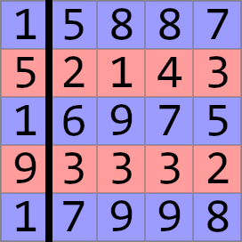

<h1 style='text-align: center;'> D. Red-Blue Matrix</h1>

<h5 style='text-align: center;'>time limit per test: 4 seconds</h5>
<h5 style='text-align: center;'>memory limit per test: 256 megabytes</h5>

You are given a matrix, consisting of $n$ rows and $m$ columns. The $j$-th cell of the $i$-th row contains an integer $a_{ij}$.

First, you have to color each row of the matrix either red or blue in such a way that at least one row is colored red and at least one row is colored blue.

Then, you have to choose an integer $k$ ($1 \le k < m$) and cut the colored matrix in such a way that the first $k$ columns become a separate matrix (the left matrix) and the last $m-k$ columns become a separate matrix (the right matrix).

The coloring and the cut are called perfect if two properties hold: 

* every red cell in the left matrix contains an integer greater than every blue cell in the left matrix;
* every blue cell in the right matrix contains an integer greater than every red cell in the right matrix.

Find any perfect coloring and cut, or report that there are none.

## Input

The first line contains a single integer $t$ ($1 \le t \le 1000$) — the number of testcases.

Then the descriptions of $t$ testcases follow.

The first line of each testcase contains two integers $n$ and $m$ ($2 \le n, m \le 5 \cdot 10^5$; $n \cdot m \le 10^6$) — the number of rows and the number of columns in the matrix, respectively.

The $i$-th of the next $n$ lines contains $m$ integers $a_{i1}, a_{i2}, \dots, a_{im}$ ($1 \le a_{ij} \le 10^6$).

The sum of $n \cdot m$ over all testcases doesn't exceed $10^6$.

## Output

For each testcase print an answer. If there are no perfect colorings and cuts in the matrix, then print "NO".

Otherwise, first, print "YES". Then a string, consisting of $n$ characters: the $i$-th character should be 'R' if the $i$-th row is colored red and 'B' if it's colored blue. The string should contain at least one 'R' and at least one 'B'. Finally, print an integer $k$ ($1 \le k < m$) — the number of columns from the left that are cut.

## Example

## Input


```

3
5 5
1 5 8 8 7
5 2 1 4 3
1 6 9 7 5
9 3 3 3 2
1 7 9 9 8
3 3
8 9 8
1 5 3
7 5 7
2 6
3 3 3 2 2 2
1 1 1 4 4 4

```
## Output


```

YES
BRBRB 1
NO
YES
RB 3

```
## Note

The coloring and the cut for the first testcase:

  

#### tags 

#2400 #brute_force #constructive_algorithms #implementation #sortings 