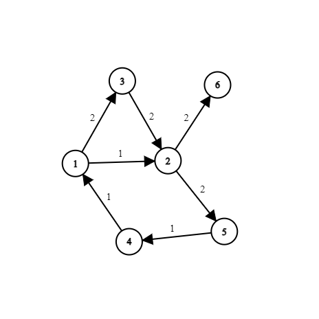
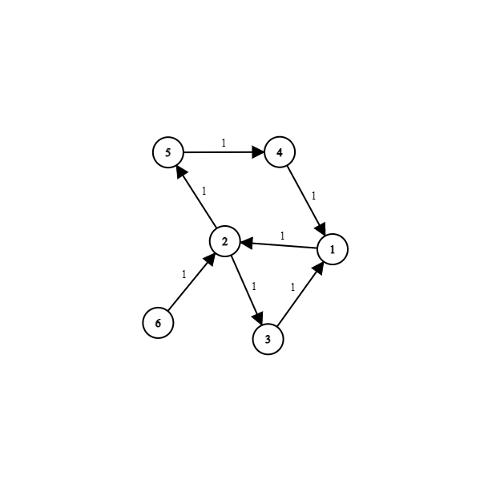

<h1 style='text-align: center;'> F. Mashtali: a Space Oddysey</h1>

<h5 style='text-align: center;'>time limit per test: 1 second</h5>
<h5 style='text-align: center;'>memory limit per test: 256 megabytes</h5>

Lee was planning to get closer to Mashtali's heart to proceed with his evil plan(which we're not aware of, yet), so he decided to beautify Mashtali's graph. But he made several rules for himself. And also he was too busy with his plans that he didn't have time for such minor tasks, so he asked you for help.

Mashtali's graph is an undirected weighted graph with $n$ vertices and $m$ edges with weights equal to either $1$ or $2$. Lee wants to direct the edges of Mashtali's graph so that it will be as beautiful as possible.

Lee thinks that the beauty of a directed weighted graph is equal to the number of its Oddysey vertices. A vertex $v$ is an Oddysey vertex if $|d^+(v) - d^-(v)| = 1$, where $d^+(v)$ is the sum of weights of the outgoing from $v$ edges, and $d^-(v)$ is the sum of the weights of the incoming to $v$ edges.

Find the largest possible beauty of a graph that Lee can achieve by directing the edges of Mashtali's graph. In addition, find any way to achieve it.

## Note

 that you have to orient each edge.

## Input

The first line contains two integers $n$ and $m$ $(1 \le n \le 10^5;\; 1 \le m \le 10^5)$ — the numbers of vertices and edges in the graph.

The $i$-th line of the following $m$ lines contains three integers $u_i$, $v_i$ and $w_i$ $( 1 \le u_i , v_i \le n;\; u_i \neq v_i;\; \bf{w_i \in \{1, 2\}} )$ — the endpoints of the $i$-th edge and its weight.

## Note

 that the graph doesn't have to be connected, and it might contain multiple edges.

## Output

In the first line print a single integer — the maximum beauty of the graph Lee can achieve.

In the second line print a string of length $m$ consisting of $1$s and $2$s — directions of the edges.

If you decide to direct the $i$-th edge from vertex $u_i$ to vertex $v_i$, $i$-th character of the string should be $1$. Otherwise, it should be $2$.

## Examples

## Input


```

6 7
1 2 1
1 3 2
2 3 2
1 4 1
4 5 1
2 5 2
2 6 2

```
## Output


```

2
1212212

```
## Input


```

6 7
1 2 2
1 3 2
2 3 2
1 4 2
4 5 2
2 5 2
2 6 2

```
## Output


```

0
1212212

```
## Input


```

6 7
1 2 1
1 3 1
2 3 1
1 4 1
4 5 1
2 5 1
2 6 1

```
## Output


```

2
1212212

```
## Note

Explanation for the first sample:

  vertices $2$ and $5$ are Oddyseys. Explanation for the third sample:

  vertices $1$ and $6$ are Oddyseys. 

#### tags 

#3000 #constructive_algorithms #dfs_and_similar #graphs 