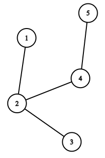

<h1 style='text-align: center;'> I. Mashtali vs AtCoder</h1>

<h5 style='text-align: center;'>time limit per test: 1 second</h5>
<h5 style='text-align: center;'>memory limit per test: 256 megabytes</h5>

After many unsuccessful tries, Mashtali decided to copy modify [an AtCoder problem](https://atcoder.jp/contests/agc017/tasks/agc017_d). So here is his copied new problem:

There is a tree with $n$ vertices and some non-empty set of the vertices are pinned to the ground.

Two players play a game against each other on the tree. They alternately perform the following action:

* Remove an edge from the tree, then remove every connected component that has no pinned vertex.The player who cannot move loses(every edge has been deleted already).

You are given the tree, but not the set of the pinned vertices. Your task is to determine, for each $k$, the winner of the game, if only the vertices $1, 2, 3, \ldots, k$ are pinned and both players play optimally.

## Input

The first line of input contains an integer $n$ — the number of vertices ($1 \le n \le 3 \cdot 10^5$).

The $i$-th of the following $n-1$ lines contains two integers $u_i, v_i$ ($1 \le u_i, v_i \le n$, $u_i \ne v_i$) — the endpoints of the $i$-th edge. It's guaranteed that these edges form a tree.

## Output

Print a string of length $n$. The $i$-th character should be '1' if the first player wins the $i$-th scenario, and '2' otherwise.

## Examples

## Input


```

5
1 2
2 3
2 4
4 5

```
## Output


```

11122

```
## Input


```

5
1 2
2 3
1 4
4 5

```
## Output


```

21122

```
## Input


```

6
1 2
2 4
5 1
6 3
3 2

```
## Output


```

111111

```
## Input


```

7
1 2
3 7
4 6
2 3
2 4
1 5

```
## Output


```

2212222

```
## Note

Below you can see the tree in the first sample :

  If $k = 1$ then the first player can cut the edge $(1, 2)$.

If $k = 2$ or $k = 3$, the first player can cut the edge $(2, 4)$, after that only the edges $(1, 2)$ and $(2, 3)$ remain. After the second players move, there will be a single edge left for the first player to cut. So first player wins.


#### tags 

#3100 #games #trees 