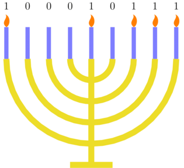

<h1 style='text-align: center;'> C. Menorah</h1>

<h5 style='text-align: center;'>time limit per test: 2 seconds</h5>
<h5 style='text-align: center;'>memory limit per test: 256 megabytes</h5>

There are $n$ candles on a Hanukkah menorah, and some of its candles are initially lit. We can describe which candles are lit with a binary string $s$, where the $i$-th candle is lit if and only if $s_i=1$.

  Initially, the candle lights are described by a string $a$. In an operation, you select a candle that is currently lit. By doing so, the candle you selected will remain lit, and every other candle will change (if it was lit, it will become unlit and if it was unlit, it will become lit).

You would like to make the candles look the same as string $b$. Your task is to determine if it is possible, and if it is, find the minimum number of operations required.

## Input

The first line contains an integer $t$ ($1\le t\le 10^4$) — the number of test cases. Then $t$ cases follow.

The first line of each test case contains a single integer $n$ ($1\le n\le 10^5$) — the number of candles.

The second line contains a string $a$ of length $n$ consisting of symbols 0 and 1 — the initial pattern of lights.

The third line contains a string $b$ of length $n$ consisting of symbols 0 and 1 — the desired pattern of lights.

It is guaranteed that the sum of $n$ does not exceed $10^5$.

## Output

For each test case, output the minimum number of operations required to transform $a$ to $b$, or $-1$ if it's impossible.

## Example

## Input


```

5
5
11010
11010
2
01
11
3
000
101
9
100010111
101101100
9
001011011
011010101

```
## Output


```

0
1
-1
3
4

```
## Note

In the first test case, the two strings are already equal, so we don't have to perform any operations.

In the second test case, we can perform a single operation selecting the second candle to transform $01$ into $11$.

In the third test case, it's impossible to perform any operations because there are no lit candles to select.

In the fourth test case, we can perform the following operations to transform $a$ into $b$: 

1. Select the $7$-th candle: $100010{\color{red}1}11\to 011101{\color{red} 1}00$.
2. Select the $2$-nd candle: $0{\color{red} 1}1101100\to 1{\color{red} 1}0010011$.
3. Select the $1$-st candle: ${\color{red}1}10010011\to {\color{red}1}01101100$.

In the fifth test case, we can perform the following operations to transform $a$ into $b$: 

1. Select the $6$-th candle: $00101{\color{red}1}011\to 11010{\color{red}1}100$
2. Select the $2$-nd candle: $1{\color{red}1}0101100\to 0{\color{red}1}1010011$
3. Select the $8$-th candle: $0110100{\color{red}1}1\to 1001011{\color{red}1}0$
4. Select the $7$-th candle: $100101{\color{red}1}10\to 011010{\color{red}1}01$


#### tags 

#1600 #brute_force #graphs #greedy #math 