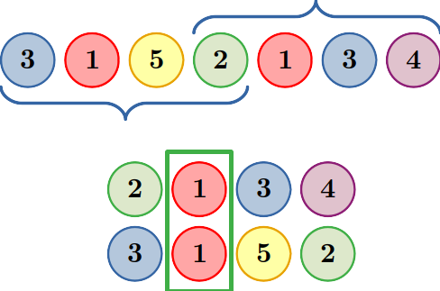

<h1 style='text-align: center;'> B. Elementary Particles</h1>

<h5 style='text-align: center;'>time limit per test: 2 seconds</h5>
<h5 style='text-align: center;'>memory limit per test: 256 megabytes</h5>

Martians are actively engaged in interplanetary trade. Olymp City, the Martian city known for its spaceport, has become a place where goods from all the corners of our Galaxy come. To deliver even more freight from faraway planets, Martians need fast spaceships.

A group of scientists conducts experiments to build a fast engine for the new spaceship. In the current experiment, there are $n$ elementary particles, the $i$-th of them has type $a_i$.

Denote a subsegment of the particle sequence ($a_1, a_2, \dots, a_n$) as a sequence ($a_l, a_{l+1}, \dots, a_r$) for some left bound $l$ and right bound $r$ ($1 \le l \le r \le n$). For instance, the sequence $(1\ 4\ 2\ 8\ 5\ 7)$ for $l=2$ and $r=4$ has the sequence $(4\ 2\ 8)$ as a subsegment. Two subsegments are considered different if at least one bound of those subsegments differs.

## Note

 that the subsegments can be equal as sequences but still considered different. For example, consider the sequence $(1\ 1\ 1\ 1\ 1)$ and two of its subsegments: one with $l=1$ and $r=3$ and another with $l=2$ and $r=4$. Both subsegments are equal to $(1\ 1\ 1)$, but still considered different, as their left and right bounds differ.

The scientists want to conduct a reaction to get two different subsegments of the same length. Denote this length $k$. The resulting pair of subsegments must be harmonious, i. e. for some $i$ ($1 \le i \le k$) it must be true that the types of particles on the $i$-th position are the same for these two subsegments. For example, the pair $(1\ 7\ 3)$ and $(4\ 7\ 8)$ is harmonious, as both subsegments have $7$ on the second position. The pair $(1\ 2\ 3)$ and $(3\ 1\ 2)$ is not harmonious.

The longer are harmonious subsegments, the more chances for the scientists to design a fast engine. So, they asked you to calculate the maximal possible length of harmonious pair made of different subsegments.

## Input

The first line contains an integer $t$ ($1 \le t \le 100$) — the number of test cases. The following are descriptions of the test cases.

The first line contains an integer $n$ ($2 \le n \le 150\,000$) — the amount of elementary particles in the sequence.

The second line contains $n$ integers $a_i$ ($1 \le a_i \le 150\,000$) — types of elementary particles.

It is guaranteed that the sum of $n$ over all test cases does not exceed $3\cdot10^5$.

## Output

For each test, print a single integer, maximal possible length of harmonious pair made of different subsegments. If such pair does not exist, print $-1$ instead.

## Example

## Input


```

473 1 5 2 1 3 461 1 1 1 1 161 4 2 8 5 7215 15
```
## Output


```

4
5
-1
1

```
## Note

The first test case is shown on the picture below:

  As you can see from it, you may choose the subsegments $(2\ 1\ 3\ 4)$ and $(3\ 1\ 5\ 2)$, which are a harmonious pair. Their length is equal to $4$, so the answer is $4$.

In the second test case, you need to take two subsegments: one with $l=1$ and $r=5$, and one with $l=2$ and $r=6$. It's not hard to observe that these segments are a harmonious pair and considered different even though they are both equal to $(1\ 1\ 1\ 1\ 1)$.

In the third test case, you cannot make a harmonious pair, so the answer is $-1$.


#### tags 

#1100 #brute_force #greedy #sortings 