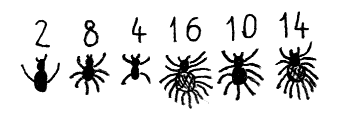

<h1 style='text-align: center;'> D. Binary Spiders</h1>

<h5 style='text-align: center;'>time limit per test: 2 seconds</h5>
<h5 style='text-align: center;'>memory limit per test: 256 megabytes</h5>

Binary Spiders are species of spiders that live on Mars. These spiders weave their webs to defend themselves from enemies.

To weave a web, spiders join in pairs. If the first spider in pair has $x$ legs, and the second spider has $y$ legs, then they weave a web with durability $x \oplus y$. Here, $\oplus$ means bitwise XOR.

Binary Spiders live in large groups. You observe a group of $n$ spiders, and the $i$-th spider has $a_i$ legs.

When the group is threatened, some of the spiders become defenders. Defenders are chosen in the following way. First, there must be at least two defenders. Second, any pair of defenders must be able to weave a web with durability at least $k$. Third, there must be as much defenders as possible.

Scientists have researched the behaviour of Binary Spiders for a long time, and now they have a hypothesis that they can always choose the defenders in an optimal way, satisfying the conditions above. You need to verify this hypothesis on your group of spiders. So, you need to understand how many spiders must become defenders. You are not a Binary Spider, so you decided to use a computer to solve this problem.

## Input

The first line contains two integers $n$ and $k$ ($2 \le n \le 3\cdot10^5$, $0 \le k \le 2^{30} - 1$), the amount of spiders in the group and the minimal allowed durability of a web.

The second line contains $n$ integers $a_i$ ($0 \le a_i \le 2^{30}-1$) — the number of legs the $i$-th spider has.

## Output

In the first line, print a single integer $\ell$ ($2 \le \ell \le n$), the maximum possible amount of defenders.

In the second line, print $\ell$ integers $b_i$, separated by a single space ($1 \le b_i \le n$) — indices of spiders that will become defenders.

If there exists more than one way to choose the defenders, print any of them.

Unfortunately, it may appear that it's impossible to choose the defenders. In this case, print a single integer $-1$.

## Examples

## Input


```

6 8
2 8 4 16 10 14

```
## Output


```

3
1 5 4

```
## Input


```

6 1024
1 2 3 1 4 0

```
## Output


```

-1

```
## Note

Consider the examples above.

In the first example, the group of spiders is illustrated on the picture below:

  We choose the two-legged, the ten-legged and the $16$-legged spiders. It's not hard to see that each pair may weave a web with enough durability, as $2 \oplus 10 = 8 \ge 8$, $2 \oplus 16 = 18 \ge 8$ and $10 \oplus 16 = 26 \ge 8$.

This is not the only way, as you can also choose, for example, the spiders with indices $3$, $4$, and $6$.

In the second example, no pair of spiders can weave the web with durability $1024$ or more, so the answer is $-1$.


#### tags 

#2300 #bitmasks #data_structures #implementation #math #sortings #trees 