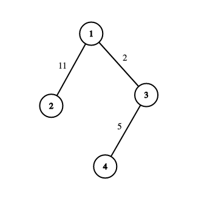
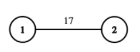

<h1 style='text-align: center;'> C. Not Assigning</h1>

<h5 style='text-align: center;'>time limit per test: 1.5 seconds</h5>
<h5 style='text-align: center;'>memory limit per test: 256 megabytes</h5>

You are given a tree of $n$ vertices numbered from $1$ to $n$, with edges numbered from $1$ to $n-1$. A tree is a connected undirected graph without cycles. You have to assign integer weights to each edge of the tree, such that the resultant graph is a prime tree.

A prime tree is a tree where the weight of every path consisting of one or two edges is prime. A path should not visit any vertex twice. The weight of a path is the sum of edge weights on that path.

Consider the graph below. It is a prime tree as the weight of every path of two or less edges is prime. For example, the following path of two edges: $2 \to 1 \to 3$ has a weight of $11 + 2 = 13$, which is prime. Similarly, the path of one edge: $4 \to 3$ has a weight of $5$, which is also prime.

  Print any valid assignment of weights such that the resultant tree is a prime tree. If there is no such assignment, then print $-1$. It can be proven that if a valid assignment exists, one exists with weights between $1$ and $10^5$ as well.

## Input

The input consists of multiple test cases. The first line contains an integer $t$ ($1 \leq t \leq 10^4$) — the number of test cases. The description of the test cases follows.

The first line of each test case contains one integer $n$ ($2 \leq n \leq 10^5$) — the number of vertices in the tree.

Then, $n-1$ lines follow. The $i$-th line contains two integers $u$ and $v$ ($1 \leq u, v \leq n$) denoting that edge number $i$ is between vertices $u$ and $v$. It is guaranteed that the edges form a tree.

It is guaranteed that the sum of $n$ over all test cases does not exceed $10^5$.

## Output

For each test case, if a valid assignment exists, then print a single line containing $n-1$ integers $a_1, a_2, \dots, a_{n-1}$ ($1 \leq a_i \le 10^5$), where $a_i$ denotes the weight assigned to the edge numbered $i$. Otherwise, print $-1$.

If there are multiple solutions, you may print any.

## Example

## Input


```

321 241 34 32 171 21 33 43 56 27 2
```
## Output


```

17
2 5 11
-1
```
## Note

For the first test case, there are only two paths having one edge each: $1 \to 2$ and $2 \to 1$, both having a weight of $17$, which is prime.

  The second test case is described in the statement.

It can be proven that no such assignment exists for the third test case.


#### tags 

#1400 #constructive_algorithms #dfs_and_similar #number_theory #trees 