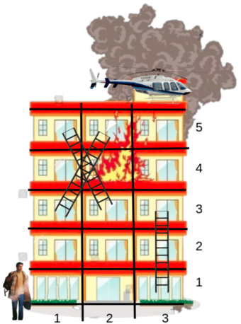

<h1 style='text-align: center;'> E. Not Escaping</h1>

<h5 style='text-align: center;'>time limit per test: 2 seconds</h5>
<h5 style='text-align: center;'>memory limit per test: 256 megabytes</h5>

Major Ram is being chased by his arch enemy Raghav. Ram must reach the top of the building to escape via helicopter. The building, however, is on fire. Ram must choose the optimal path to reach the top of the building to lose the minimum amount of health.

The building consists of $n$ floors, each with $m$ rooms each. Let $(i, j)$ represent the $j$-th room on the $i$-th floor. Additionally, there are $k$ ladders installed. The $i$-th ladder allows Ram to travel from $(a_i, b_i)$ to $(c_i, d_i)$, but not in the other direction. Ram also gains $h_i$ health points if he uses the ladder $i$. It is guaranteed $a_i < c_i$ for all ladders.

If Ram is on the $i$-th floor, he can move either left or right. Travelling across floors, however, is treacherous. If Ram travels from $(i, j)$ to $(i, k)$, he loses $|j-k| \cdot x_i$ health points.

Ram enters the building at $(1, 1)$ while his helicopter is waiting at $(n, m)$. What is the minimum amount of health Ram loses if he takes the most optimal path? ## Note

 this answer may be negative (in which case he gains health). ## Output

 "NO ESCAPE" if no matter what path Ram takes, he cannot escape the clutches of Raghav.

  ## Input

The first line of input contains $t$ ($1 \leq t \leq 5 \cdot 10^4$) — the number of test cases.

The first line of each test case consists of $3$ integers $n, m, k$ ($2 \leq n, m \leq 10^5$; $1 \leq k \leq 10^5$) — the number of floors, the number of rooms on each floor and the number of ladders respectively.

The second line of a test case consists of $n$ integers $x_1, x_2, \dots, x_n$ ($1 \leq x_i \leq 10^6$).

The next $k$ lines describe the ladders. Ladder $i$ is denoted by $a_i, b_i, c_i, d_i, h_i$ ($1 \leq a_i < c_i \leq n$; $1 \leq b_i, d_i \leq m$; $1 \leq h_i \leq 10^6$)  — the rooms it connects and the health points gained from using it.

It is guaranteed $a_i < c_i$ for all ladders and there is at most one ladder between any 2 rooms in the building.

The sum of $n$, the sum of $m$, and the sum of $k$ over all test cases do not exceed $10^5$.

## Output

## Output

 the minimum health Ram loses on the optimal path from $(1, 1)$ to $(n, m)$. If Ram cannot escape the clutches of Raghav regardless of the path he takes, output "NO ESCAPE" (all uppercase, without quotes).

## Example

## Input


```

45 3 35 17 8 1 41 3 3 3 43 1 5 2 53 2 5 1 66 3 35 17 8 1 4 21 3 3 3 43 1 5 2 53 2 5 1 65 3 15 17 8 1 41 3 5 3 1005 5 53 2 3 7 53 5 4 2 12 2 5 4 54 4 5 2 31 2 4 2 23 3 5 2 4
```
## Output


```

16
NO ESCAPE
-90
27

```
## Note

The figure for the first test case is in the statement. There are only $2$ possible paths to $(n, m)$: 

* Ram travels to $(1, 3)$, takes the ladder to $(3, 3)$, travels to $(3, 2)$, takes the ladder to $(5, 1)$, travels to $(5, 3)$ where he finally escapes via helicopter. The health lost would be $$ \begin{align*} &\mathrel{\phantom{=}} x_1 \cdot |1-3| - h_1 + x_3 \cdot |3-2| - h_3 + x_5 \cdot |1-3| \\\ &= 5 \cdot 2 - 4 + 8 \cdot 1 - 6 + 4 \cdot 2 \\\ &= 16. \end{align*} $$
* Ram travels to $(1, 3)$, takes the ladder to $(3, 3)$, travels to $(3, 1)$, takes the ladder to $(5, 2)$, travels to $(5, 3)$ where he finally escapes via helicopter. The health lost would be $$ \begin{align*} &\mathrel{\phantom{=}} x_1 \cdot |1-3| - h_1 + x_3 \cdot |3-1| - h_2 + a_5 \cdot |2-3| \\\ &= 5 \cdot 2 - 4 + 8 \cdot 2 - 5 + 4 \cdot 1 \\\ &= 21. \end{align*} $$

 Therefore, the minimum health lost would be $16$.In the second test case, there is no path to $(n, m)$.

In the third case case, Ram travels to $(1, 3)$ and takes the only ladder to $(5, 3)$. He loses $5 \cdot 2$ health points and gains $h_1 = 100$ health points. Therefore the total loss is $10-100=-90$ (negative implies he gains health after the path).


#### tags 

#2200 #data_structures #dp #implementation #shortest_paths #two_pointers 