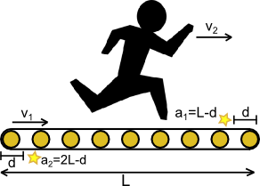

<h1 style='text-align: center;'> C. Conveyor</h1>

<h5 style='text-align: center;'>time limit per test: 1 second</h5>
<h5 style='text-align: center;'>memory limit per test: 256 megabytes</h5>

Anton came to a chocolate factory. There he found a working conveyor and decided to run on it from the beginning to the end.

The conveyor is a looped belt with a total length of 2*l* meters, of which *l* meters are located on the surface and are arranged in a straight line. The part of the belt which turns at any moment (the part which emerges from under the floor to the surface and returns from the surface under the floor) is assumed to be negligibly short.

The belt is moving uniformly at speed *v*1 meters per second. Anton will be moving on it in the same direction at the constant speed of *v*2 meters per second, so his speed relatively to the floor will be *v*1 + *v*2 meters per second. Anton will neither stop nor change the speed or the direction of movement.

Here and there there are chocolates stuck to the belt (*n* chocolates). They move together with the belt, and do not come off it. Anton is keen on the chocolates, but he is more keen to move forward. So he will pick up all the chocolates he will pass by, but nothing more. If a chocolate is at the beginning of the belt at the moment when Anton starts running, he will take it, and if a chocolate is at the end of the belt at the moment when Anton comes off the belt, he will leave it.

   The figure shows an example with two chocolates. One is located in the position *a*1 = *l* - *d*, and is now on the top half of the belt, the second one is in the position *a*2 = 2*l* - *d*, and is now on the bottom half of the belt.  You are given the positions of the chocolates relative to the initial start position of the belt 0 ≤ *a*1 < *a*2 < ... < *a**n* < 2*l*. The positions on the belt from 0 to *l* correspond to the top, and from *l* to 2*l* — to the the bottom half of the belt (see example). All coordinates are given in meters.

Anton begins to run along the belt at a random moment of time. This means that all possible positions of the belt at the moment he starts running are equiprobable. For each *i* from 0 to *n* calculate the probability that Anton will pick up exactly *i* chocolates.

## Input

The first line contains space-separated integers *n*, *l*, *v*1 and *v*2 (1 ≤ *n* ≤ 105, 1 ≤ *l*, *v*1, *v*2 ≤ 109) — the number of the chocolates, the length of the conveyor's visible part, the conveyor's speed and Anton's speed.

The second line contains a sequence of space-separated integers *a*1, *a*2, ..., *a**n* (0 ≤ *a*1 < *a*2 < ... < *a**n* < 2*l*) — the coordinates of the chocolates.

## Output

Print *n* + 1 numbers (one per line): the probabilities that Anton picks up exactly *i* chocolates, for each *i* from 0 (the first line) to *n* (the last line). The answer will be considered correct if each number will have absolute or relative error of at most than 10- 9.

## Examples

## Input


```
1 1 1 1  
0  

```
## Output


```
0.75000000000000000000  
0.25000000000000000000  

```
## Input


```
2 3 1 2  
2 5  

```
## Output


```
0.33333333333333331000  
0.66666666666666663000  
0.00000000000000000000  

```
## Note

In the first sample test Anton can pick up a chocolate if by the moment he starts running its coordinate is less than 0.5; but if by the moment the boy starts running the chocolate's coordinate is greater than or equal to 0.5, then Anton won't be able to pick it up. As all positions of the belt are equiprobable, the probability of picking up the chocolate equals , and the probability of not picking it up equals .


#### tags 

#2100 #sortings #two_pointers 