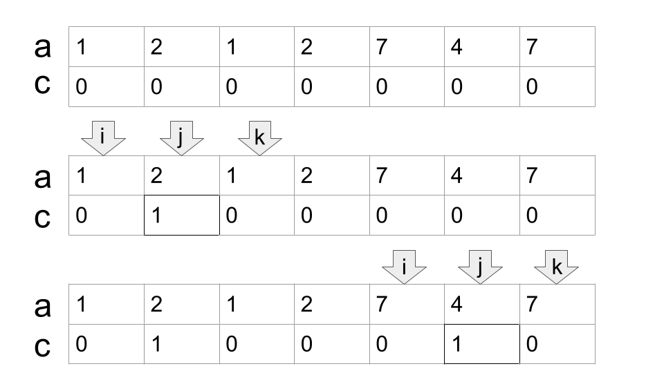

<h1 style='text-align: center;'> C. Paint the Middle</h1>

<h5 style='text-align: center;'>time limit per test: 2 seconds</h5>
<h5 style='text-align: center;'>memory limit per test: 256 megabytes</h5>

You are given $n$ elements numbered from $1$ to $n$, the element $i$ has value $a_i$ and color $c_i$, initially, $c_i = 0$ for all $i$.

The following operation can be applied:

* Select three elements $i$, $j$ and $k$ ($1 \leq i < j < k \leq n$), such that $c_i$, $c_j$ and $c_k$ are all equal to $0$ and $a_i = a_k$, then set $c_j = 1$.

Find the maximum value of $\sum\limits_{i=1}^n{c_i}$ that can be obtained after applying the given operation any number of times.

## Input

The first line contains an integer $n$ ($3 \leq n \leq 2 \cdot 10^5$) — the number of elements.

The second line consists of $n$ integers $a_1, a_2, \dots, a_n$ ($1 \leq a_i \leq n$), where $a_i$ is the value of the $i$-th element.

## Output

Print a single integer in a line — the maximum value of $\sum\limits_{i=1}^n{c_i}$ that can be obtained after applying the given operation any number of times.

## Examples

## Input


```

7
1 2 1 2 7 4 7

```
## Output


```

2

```
## Input


```

13
1 2 3 2 1 3 3 4 5 5 5 4 7

```
## Output


```

7

```
## Note

In the first test, it is possible to apply the following operations in order:

  

#### tags 

#2200 #dp #greedy #sortings #two_pointers 