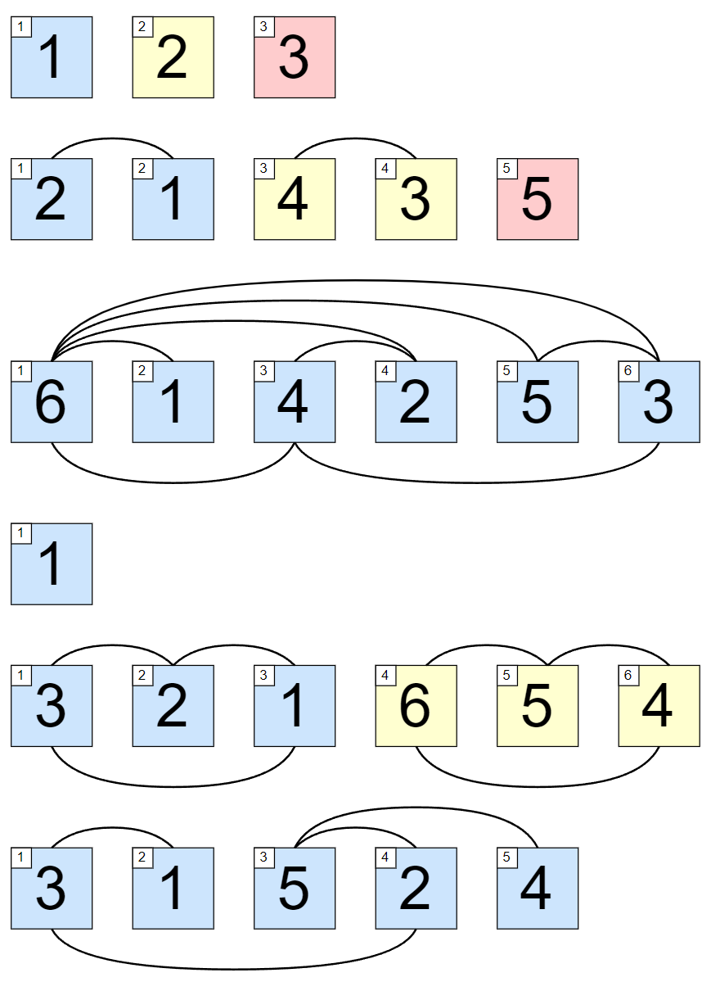

<h1 style='text-align: center;'> C. Inversion Graph</h1>

<h5 style='text-align: center;'>time limit per test: 1 second</h5>
<h5 style='text-align: center;'>memory limit per test: 256 megabytes</h5>

You are given a permutation $p_1, p_2, \dots, p_n$. Then, an undirected graph is constructed in the following way: add an edge between vertices $i$, $j$ such that $i < j$ if and only if $p_i > p_j$. Your task is to count the number of connected components in this graph.

Two vertices $u$ and $v$ belong to the same connected component if and only if there is at least one path along edges connecting $u$ and $v$.

A permutation is an array consisting of $n$ distinct integers from $1$ to $n$ in arbitrary order. For example, $[2,3,1,5,4]$ is a permutation, but $[1,2,2]$ is not a permutation ($2$ appears twice in the array) and $[1,3,4]$ is also not a permutation ($n=3$ but there is $4$ in the array).

## Input

Each test contains multiple test cases. The first line contains a single integer $t$ ($1 \le t \le 10^5$) — the number of test cases. Description of the test cases follows.

The first line of each test case contains a single integer $n$ ($1 \le n \le 10^5$) — the length of the permutation.

The second line of each test case contains $n$ integers $p_1, p_2, \dots, p_n$ ($1 \le p_i \le n$) — the elements of the permutation.

It is guaranteed that the sum of $n$ over all test cases does not exceed $2 \cdot 10^5$.

## Output

For each test case, print one integer $k$ — the number of connected components.

## Example

## Input


```

631 2 352 1 4 3 566 1 4 2 5 31163 2 1 6 5 453 1 5 2 4
```
## Output


```

3
3
1
1
2
1

```
## Note

Each separate test case is depicted in the image below. The colored squares represent the elements of the permutation. For one permutation, each color represents some connected component. The number of distinct colors is the answer.

  

#### tags 

#1300 #data_structures #dsu #graphs #math 