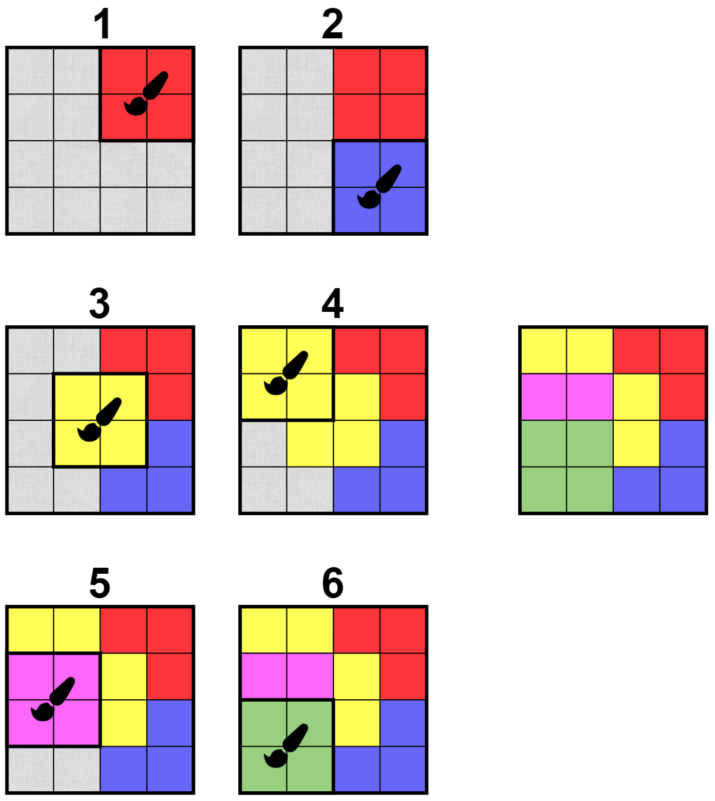

<h1 style='text-align: center;'> D. Big Brush</h1>

<h5 style='text-align: center;'>time limit per test: 3 seconds</h5>
<h5 style='text-align: center;'>memory limit per test: 256 megabytes</h5>

You found a painting on a canvas of size $n \times m$. The canvas can be represented as a grid with $n$ rows and $m$ columns. Each cell has some color. Cell $(i, j)$ has color $c_{i,j}$.

Near the painting you also found a brush in the shape of a $2 \times 2$ square, so the canvas was surely painted in the following way: initially, no cell was painted. Then, the following painting operation has been performed some number of times:

* Choose two integers $i$ and $j$ ($1 \le i < n$, $1 \le j < m$) and some color $k$ ($1 \le k \le nm$).
* Paint cells $(i, j)$, $(i + 1, j)$, $(i, j + 1)$, $(i + 1, j + 1)$ in color $k$.

All cells must be painted at least once. A cell can be painted multiple times. In this case, its final color will be the last one.

Find any sequence of at most $nm$ operations that could have led to the painting you found or state that it's impossible.

## Input

The first line of input contains two integers $n$ and $m$ ($2 \le n, m \le 1000$) — the dimensions of the canvas.

On the $i$-th of the next $n$ lines of input, there will be $m$ integers. The $j$-th of them is $a_{i,j}$ ($1 \le a_{i,j} \le nm$) — the color of cell $(i, j)$.

## Output

If there is no solution, print a single integer $-1$.

Otherwise, on the first line, print one integer $q$ ($1 \le q \le nm$) — the number of operations.

Next, print the operations in order. On the $k$-th of the next $q$ lines, print three integers $i$, $j$, $c$ ($1 \le i < n$, $1 \le j < m$, $1 \le c \le nm$) — the description of the $k$-th operation.

If there are multiple solutions, print any.

## Examples

## Input


```

4 4
5 5 3 3
1 1 5 3
2 2 5 4
2 2 4 4

```
## Output


```

6
1 3 3
3 3 4
2 2 5
1 1 5
2 1 1
3 1 2

```
## Input


```

3 4
1 1 1 1
2 2 3 1
2 2 1 1

```
## Output


```

-1

```
## Note

In the first test case, the solution is not unique. Here's one of them:

  In the second test case, there is no way one could obtain the given painting, thus the answer is $-1$.


#### tags 

#2000 #constructive_algorithms #data_structures #greedy #implementation 