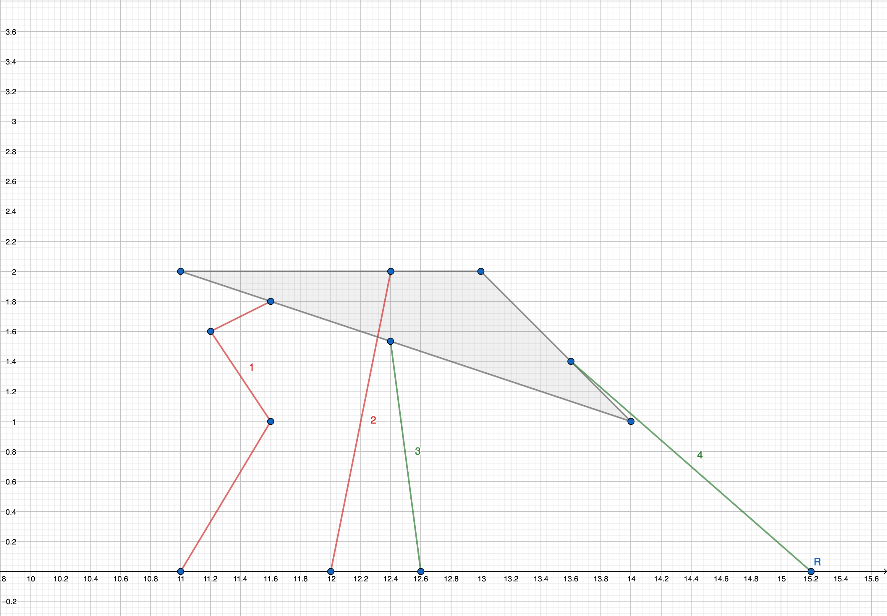
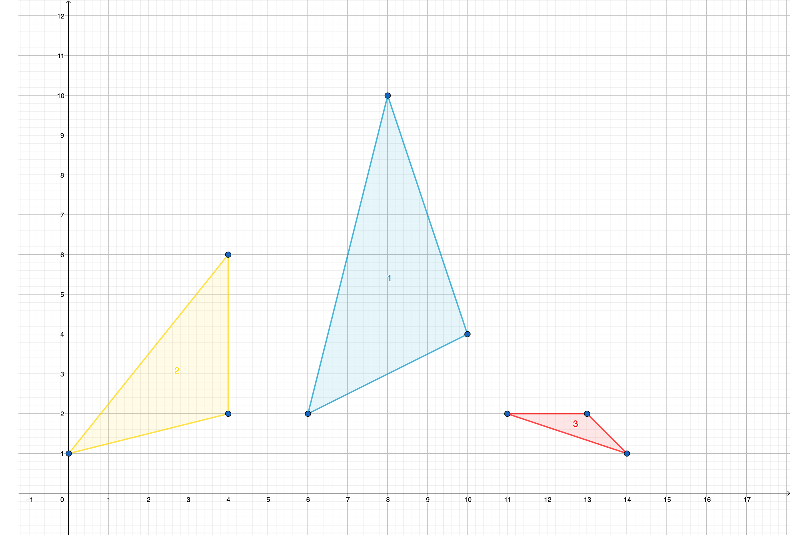
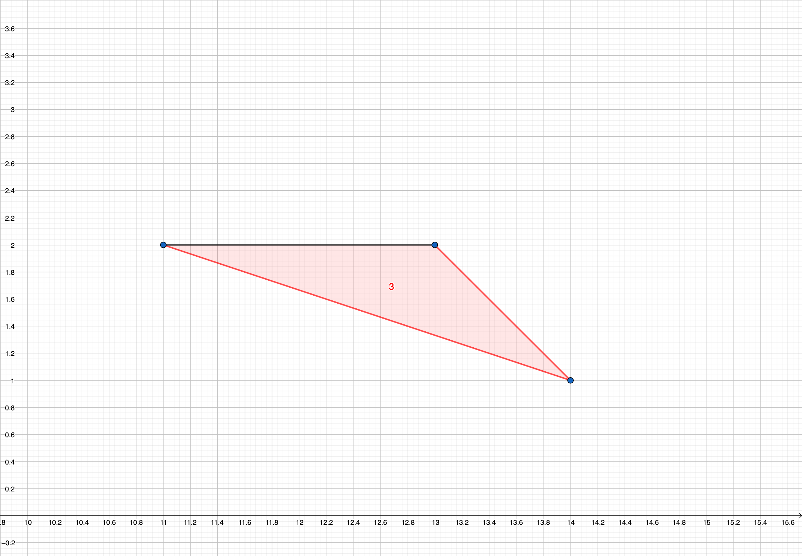

<h1 style='text-align: center;'> A. Hard Way</h1>

<h5 style='text-align: center;'>time limit per test: 1 second</h5>
<h5 style='text-align: center;'>memory limit per test: 256 megabytes</h5>

Sam lives in Awesomeburg, its downtown has a triangular shape. Also, the following is true about the triangle:

* its vertices have integer coordinates,
* the coordinates of vertices are non-negative, and
* its vertices are not on a single line.

He calls a point on the downtown's border (that is the border of the triangle) safe if he can reach this point from at least one point of the line $y = 0$ walking along some straight line, without crossing the interior of the triangle.

  In the picture the downtown is marked with grey color. The first path is invalid because it does not go along a straight line. The second path is invalid because it intersects with the interior of the downtown. The third and fourth paths are correct. Find the total length of the unsafe parts of the downtown border. It can be proven that these parts are segments and their number is finite.

## Input

Each test contains multiple test cases. The first line contains a single integer $t$ ($1 \le t \le 1000$) — the number of test cases. Description of the test cases follows.

Each test case contains three lines, each of them contains two integers $x_i$, $y_i$ ($0 \le x_i, y_i \le 10^9$) — coordinates of the vertices of the downtown's border.

## Output

For each test case print a single number — the answer to the problem.

Your answer will be considered correct if its absolute or relative error does not exceed $10^{-9}$. Formally let your answer be $a$, jury answer be $b$. Your answer will be considered correct if $\frac{|a - b|}{\max{(1, |b|)}} \le 10^{-9}$.

## Example

## Input


```

58 1010 46 24 60 14 214 111 213 20 04 02 40 11 10 0
```
## Output


```

0.0000000
0
2.0000
0.00
1

```
## Note

In the picture, the downtowns of the first three test cases are illustrated. Triangles are enumerated according to the indices of test cases they belong to.

  In the first two test cases, all points on the borders of the downtowns are safe, thus the answers are $0$.

In the following picture unsafe points for the third test case are marked with black color:

  In the fourth test case, all points on the border of the downtown are safe.


#### tags 

#800 #geometry 