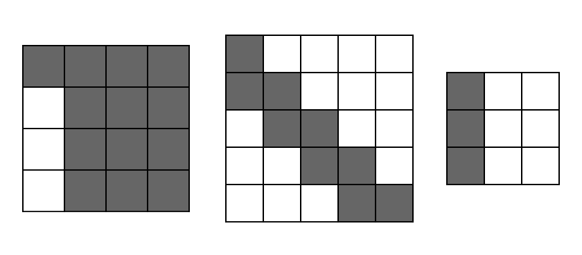

<h1 style='text-align: center;'> E. Expand the Path</h1>

<h5 style='text-align: center;'>time limit per test: 2 seconds</h5>
<h5 style='text-align: center;'>memory limit per test: 256 megabytes</h5>

Consider a grid of size $n \times n$. The rows are numbered top to bottom from $1$ to $n$, the columns are numbered left to right from $1$ to $n$.

The robot is positioned in a cell $(1, 1)$. It can perform two types of moves:

* D — move one cell down;
* R — move one cell right.

The robot is not allowed to move outside the grid.

You are given a sequence of moves $s$ — the initial path of the robot. This path doesn't lead the robot outside the grid.

You are allowed to perform an arbitrary number of modifications to it (possibly, zero). With one modification, you can duplicate one move in the sequence. That is, replace a single occurrence of D with DD or a single occurrence of R with RR.

Count the number of cells such that there exists at least one sequence of modifications that the robot visits this cell on the modified path and doesn't move outside the grid.

## Input

The first line contains a single integer $t$ ($1 \le t \le 10^4$) — the number of testcases.

The first line of each testcase contains the single integer $n$ ($2 \le n \le 10^8$) — the number of rows and columns in the grid.

The second line of each testcase contains a non-empty string $s$, consisting only of characters D and R, — the initial path of the robot. This path doesn't lead the robot outside the grid.

The total length of strings $s$ over all testcases doesn't exceed $2 \cdot 10^5$.

## Output

For each testcase, print a single integer — the number of cells such that there exists at least one sequence of modifications that the robot visits this cell on the modified path and doesn't move outside the grid.

## Example

## Input


```

34RD5DRDRDRDR3D
```
## Output


```

13
9
3

```
## Note

In the first testcase, it's enough to consider the following modified paths: 

* RD $\rightarrow$ RRD $\rightarrow$ RRRD $\rightarrow$ RRRDD $\rightarrow$ RRRDDD — this path visits cells $(1, 1)$, $(1, 2)$, $(1, 3)$, $(1, 4)$, $(2, 4)$, $(3, 4)$ and $(4, 4)$;
* RD $\rightarrow$ RRD $\rightarrow$ RRDD $\rightarrow$ RRDDD — this path visits cells $(1, 1)$, $(1, 2)$, $(1, 3)$, $(2, 3)$, $(3, 3)$ and $(4, 3)$;
* RD $\rightarrow$ RDD $\rightarrow$ RDDD — this path visits cells $(1, 1)$, $(1, 2)$, $(2, 2)$, $(3, 2)$ and $(4, 2)$.

Thus, the cells that are visited on at least one modified path are: $(1, 1)$, $(1, 2)$, $(1, 3)$, $(1, 4)$, $(2, 2)$, $(2, 3)$, $(2, 4)$, $(3, 2)$, $(3, 3)$, $(3, 4)$, $(4, 2)$, $(4, 3)$ and $(4, 4)$.

In the second testcase, there is no way to modify the sequence without moving the robot outside the grid. So the only visited cells are the ones that are visited on the path DRDRDRDR.

In the third testcase, the cells that are visited on at least one modified path are: $(1, 1)$, $(2, 1)$ and $(3, 1)$.

Here are the cells for all testcases:

  

#### tags 

#1900 #brute_force #combinatorics #data_structures #implementation #math 