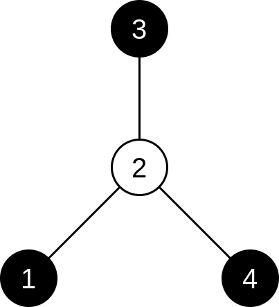
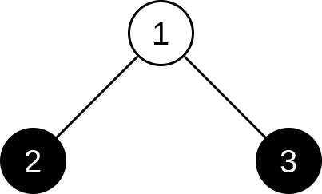

<h1 style='text-align: center;'> D. Weight the Tree</h1>

<h5 style='text-align: center;'>time limit per test: 2 seconds</h5>
<h5 style='text-align: center;'>memory limit per test: 256 megabytes</h5>

You are given a tree of $n$ vertices numbered from $1$ to $n$. A tree is a connected undirected graph without cycles. 

For each $i=1,2, \ldots, n$, let $w_i$ be the weight of the $i$-th vertex. A vertex is called good if its weight is equal to the sum of the weights of all its neighbors.

Initially, the weights of all nodes are unassigned. Assign positive integer weights to each vertex of the tree, such that the number of good vertices in the tree is maximized. If there are multiple ways to do it, you have to find one that minimizes the sum of weights of all vertices in the tree.

## Input

The first line contains one integer $n$ ($2\le n\le 2\cdot 10^5$) — the number of vertices in the tree.

Then, $n−1$ lines follow. Each of them contains two integers $u$ and $v$ ($1\le u,v\le n$) denoting an edge between vertices $u$ and $v$. It is guaranteed that the edges form a tree.

## Output

In the first line print two integers  — the maximum number of good vertices and the minimum possible sum of weights for that maximum.

In the second line print $n$ integers $w_1, w_2, \ldots, w_n$ ($1\le w_i\le 10^9$)  — the corresponding weight assigned to each vertex. It can be proven that there exists an optimal solution satisfying these constraints.

If there are multiple optimal solutions, you may print any.

## Examples

## Input


```

4
1 2
2 3
2 4

```
## Output


```

3 4
1 1 1 1 

```
## Input


```

3
1 2
1 3

```
## Output


```

2 3
1 1 1 

```
## Input


```

2
1 2

```
## Output


```

2 2
1 1

```
## Input


```

9
3 4
7 6
2 1
8 3
5 6
1 8
8 6
9 6

```
## Output


```

6 11
1 1 1 1 1 1 1 3 1 

```
## Note

This is the tree for the first test case: 

   In this case, if you assign a weight of $1$ to each vertex, then the good vertices (which are painted black) are $1$, $3$ and $4$. It impossible to assign weights so that all vertices are good vertices. The minimum sum of weights in this case is $1+1+1+1=4$, and it is impossible to have a lower sum because the weights have to be positive integers.This is the tree for the second test case: 

   In this case, if you assign a weight of $1$ to each vertex, then the good vertices (which are painted black) are $2$ and $3$. It can be proven that this is an optimal assignment.

#### tags 

#2000 #constructive_algorithms #dfs_and_similar #dp #implementation #trees 