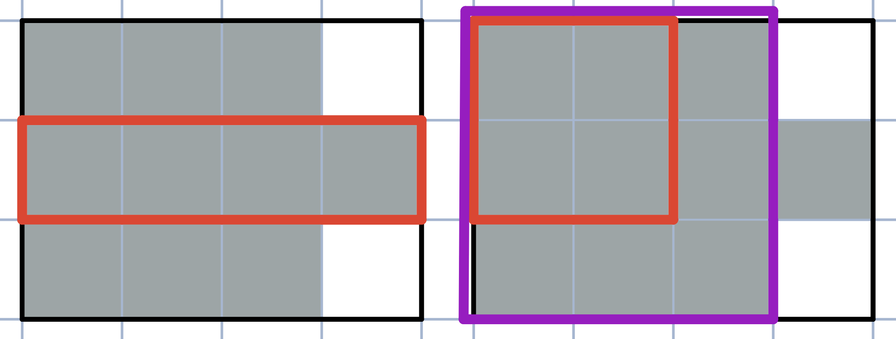
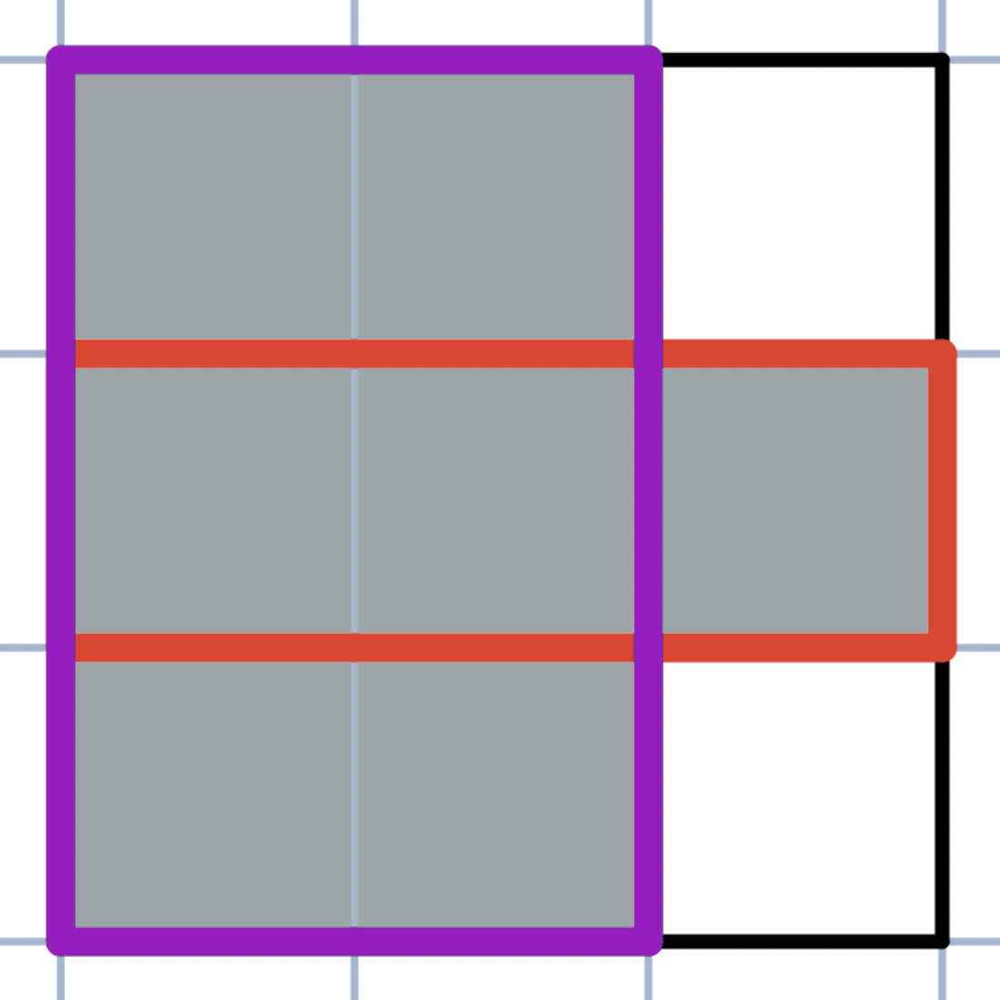
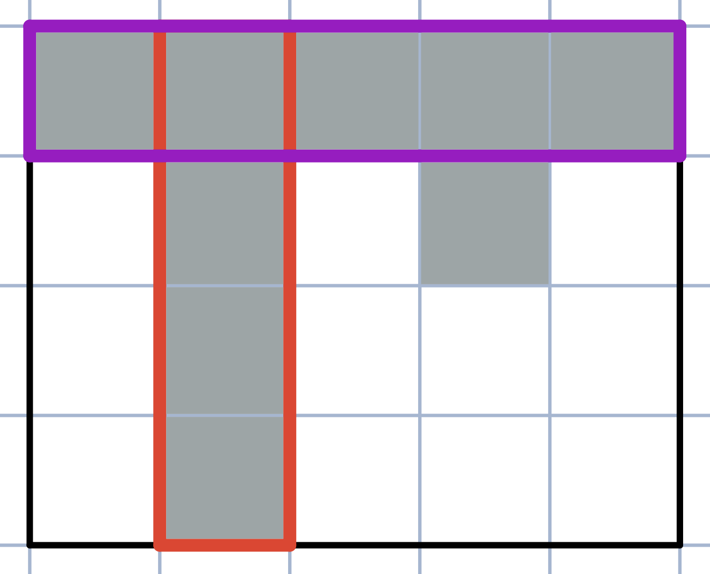

<h1 style='text-align: center;'> B. Madoka and the Elegant Gift</h1>

<h5 style='text-align: center;'>time limit per test: 1 second</h5>
<h5 style='text-align: center;'>memory limit per test: 256 megabytes</h5>

Madoka's father just reached $1$ million subscribers on Mathub! So the website decided to send him a personalized award — The Mathhub's Bit Button! 

The Bit Button is a rectangular table with $n$ rows and $m$ columns with $0$ or $1$ in each cell. After exploring the table Madoka found out that:

* A subrectangle $A$ is contained in a subrectangle $B$ if there's no cell contained in $A$ but not contained in $B$.
* Two subrectangles intersect if there is a cell contained in both of them.
* A subrectangle is called black if there's no cell with value $0$ inside it.
* A subrectangle is called nice if it's black and it's not contained in another black subrectangle.
* The table is called elegant if there are no two nice intersecting subrectangles.

For example, in the first illustration the red subrectangle is nice, but in the second one it's not, because it's contained in the purple subrectangle.

  Help Madoka to determine whether the table is elegant.

## Input

Each test contains multiple test cases. The first line contains a single integer $t$ ($1 \le t \le 200$) — the number of test cases. Description of the test cases follows.

The first line of each test case contains two positive integers $n, m$ ($1 \le n, m \le 100$).

The next $n$ lines contain strings of length $m$ consisting of zeros and ones — the description of the table.

It is guaranteed that the sum of the values of $n$ and the sum of the values of $m$ for all test cases do not exceed $777$.

## Output

For each test case print "YES" if its table is elegant or print "NO" otherwise.

You may print each letter in any case (for example, "YES", "Yes", "yes", "yEs" will all be recognized as positive answer).

## Example

## Input


```

53 31000110113 31101111101 5011114 5111110101001000010003 2110011
```
## Output


```

YES
NO
YES
NO
YES

```
## Note

In the second test case the table is not elegant, because the red and the purple subrectangles are nice and intersect. 

  In the fourth test case the table is not elegant, because the red and the purple subrectangles are nice and intersect. 

  

#### tags 

#1200 #brute_force #constructive_algorithms #graphs #implementation 