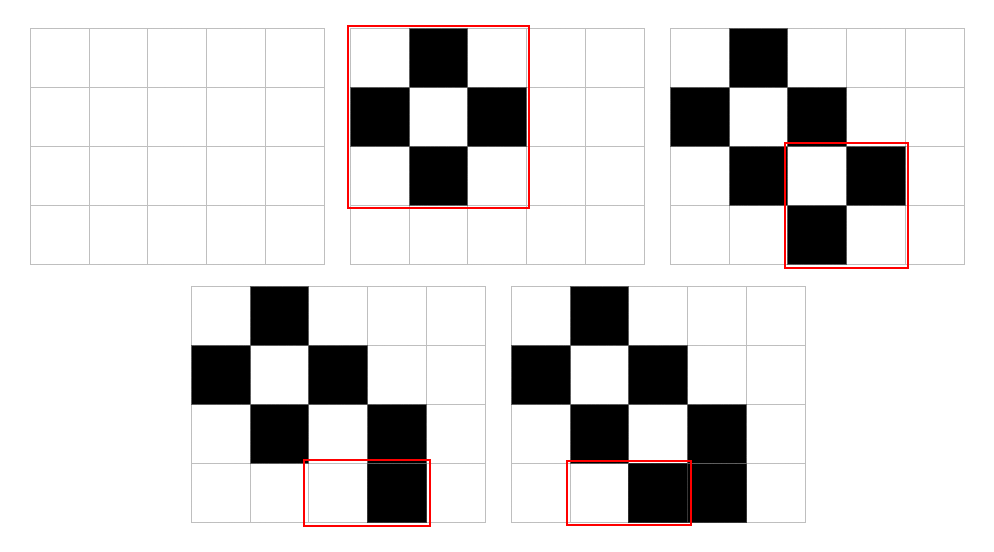

<h1 style='text-align: center;'> C. Madoka and Childish Pranks</h1>

<h5 style='text-align: center;'>time limit per test: 1 second</h5>
<h5 style='text-align: center;'>memory limit per test: 256 megabytes</h5>

Madoka as a child was an extremely capricious girl, and one of her favorite pranks was drawing on her wall. According to Madoka's memories, the wall was a table of $n$ rows and $m$ columns, consisting only of zeroes and ones. The coordinate of the cell in the $i$-th row and the $j$-th column ($1 \le i \le n$, $1 \le j \le m$) is $(i, j)$.

One day she saw a picture "Mahou Shoujo Madoka Magica" and decided to draw it on her wall. Initially, the Madoka's table is a table of size $n \times m$ filled with zeroes. Then she applies the following operation any number of times:

Madoka selects any rectangular subtable of the table and paints it in a chess coloring (the upper left corner of the subtable always has the color $0$). ## Note

 that some cells may be colored several times. In this case, the final color of the cell is equal to the color obtained during the last repainting.

  White color means $0$, black means $1$. So, for example, the table in the first picture is painted in a chess coloring, and the others are not. For better understanding of the statement, we recommend you to read the explanation of the first test.

Help Madoka and find some sequence of no more than $n \cdot m$ operations that allows you to obtain the picture she wants, or determine that this is impossible.

## Input

Each test contains multiple test cases. The first line contains a single integer $t$ ($1 \le t \le 10$) — the number of test cases. Description of the test cases follows.

The first line of each test case contains two integers $n$ and $m$ ($1 \leq n, m \leq 100$) — the size of the table. Each of the following $n$ lines contains a string of length $m$ consisting only of $1$ and $0$ — description of the picture that Madoka wants to obtain.

## Output

If it is impossible to obtain the given picture, print $-1$.

Otherwise, print in the first line a single integer $q$ ($0 \leq q \leq n \cdot m$) — the number of operations you need to obtain the picture. ## Note

 that you do not need to minimize the number of operations.

Then for each operation (in the order of execution) print a single line containing four numbers — the coordinates of the upper-left corner and the lower-right corner of the rectangle.

## Example

## Input


```

44 5010001010001010001102 30010103 31101010001 10
```
## Output


```

4
1 1 3 3
3 3 4 4
4 3 4 4
4 2 4 3
1
1 2 2 3
-1
0

```
## Note

The description of the first test case is below.

  In the third test case, it is impossible to paint the desired picture.

In the fourth test case, the initial table is already the desired picture.


#### tags 

#1300 #constructive_algorithms #greedy 