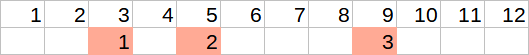
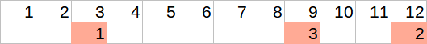
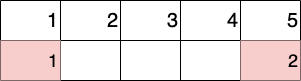
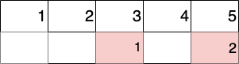
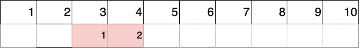
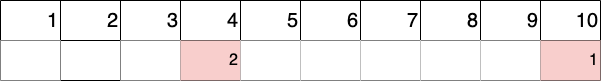

<h1 style='text-align: center;'> E. Rescheduling the Exam</h1>

<h5 style='text-align: center;'>time limit per test: 2 seconds</h5>
<h5 style='text-align: center;'>memory limit per test: 256 megabytes</h5>

Now Dmitry has a session, and he has to pass $n$ exams. The session starts on day $1$ and lasts $d$ days. The $i$th exam will take place on the day of $a_i$ ($1 \le a_i \le d$), all $a_i$ — are different.

  Sample, where $n=3$, $d=12$, $a=[3,5,9]$. Orange — exam days. Before the first exam Dmitry will rest $2$ days, before the second he will rest $1$ day and before the third he will rest $3$ days. For the session schedule, Dmitry considers a special value $\mu$ — the smallest of the rest times before the exam for all exams. For example, for the image above, $\mu=1$. In other words, for the schedule, he counts exactly $n$ numbers  — how many days he rests between the exam $i-1$ and $i$ (for $i=0$ between the start of the session and the exam $i$). Then it finds $\mu$ — the minimum among these $n$ numbers.

Dmitry believes that he can improve the schedule of the session. He may ask to change the date of one exam (change one arbitrary value of $a_i$). Help him change the date so that all $a_i$ remain different, and the value of $\mu$ is as large as possible.

For example, for the schedule above, it is most advantageous for Dmitry to move the second exam to the very end of the session. The new schedule will take the form:

  Now the rest periods before exams are equal to $[2,2,5]$. So, $\mu=2$. Dmitry can leave the proposed schedule unchanged (if there is no way to move one exam so that it will lead to an improvement in the situation).

## Input

The first line of input data contains an integer $t$ ($1 \le t \le 10^4$) — the number of input test cases. The descriptions of test cases follow.

An empty line is written in the test before each case.

The first line of each test case contains two integers $n$ and $d$ ($2 \le n \le 2 \cdot 10^5, 1 \le d \le 10^9$) — the number of exams and the length of the session, respectively.

The second line of each test case contains $n$ integers $a_i$ ($1 \le a_i \le d, a_i < a_{i+1}$), where the $i$-th number means the date of the $i$-th exam.

It is guaranteed that the sum of $n$ for all test cases does not exceed $2 \cdot 10^5$.

## Output

For each test case, output the maximum possible value of $\mu$ if Dmitry can move any one exam to an arbitrary day. All values of $a_i$ should remain distinct.

## Example

## Input


```

9  
3 123 5 9  
2 51 5  
2 1001 2  
5 153 6 9 12 15  
3 10000000001 400000000 500000000  
2 103 4  
2 21 2  
4 156 11 12 13  
2 2017 20
```
## Output


```

2
1
1
2
99999999
3
0
1
9

```
## Note

The first sample is parsed in statement.

One of the optimal schedule changes for the second sample:

 Initial schedule.

 New schedule.

In the third sample, we need to move the exam from day $1$ to any day from $4$ to $100$.

In the fourth sample, any change in the schedule will only reduce $\mu$, so the schedule should be left as it is.

In the fifth sample, we need to move the exam from day $1$ to any day from $100000000$ to $300000000$.

One of the optimal schedule changes for the sixth sample:

 Initial schedule.

 New schedule.

In the seventh sample, every day is exam day, and it is impossible to rearrange the schedule.


#### tags 

#1900 #binary_search #data_structures #greedy #implementation #math #sortings 