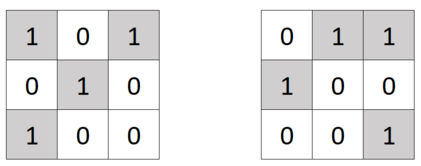

<h1 style='text-align: center;'> E. Matrix and Shifts</h1>

<h5 style='text-align: center;'>time limit per test: 2 seconds</h5>
<h5 style='text-align: center;'>memory limit per test: 256 megabytes</h5>

You are given a binary matrix $A$ of size $n \times n$. Rows are numbered from top to bottom from $1$ to $n$, columns are numbered from left to right from $1$ to $n$. The element located at the intersection of row $i$ and column $j$ is called $A_{ij}$. Consider a set of $4$ operations:

1. Cyclically shift all rows up. The row with index $i$ will be written in place of the row $i-1$ ($2 \le i \le n$), the row with index $1$ will be written in place of the row $n$.
2. Cyclically shift all rows down. The row with index $i$ will be written in place of the row $i+1$ ($1 \le i \le n - 1$), the row with index $n$ will be written in place of the row $1$.
3. Cyclically shift all columns to the left. The column with index $j$ will be written in place of the column $j-1$ ($2 \le j \le n$), the column with index $1$ will be written in place of the column $n$.
4. Cyclically shift all columns to the right. The column with index $j$ will be written in place of the column $j+1$ ($1 \le j \le n - 1$), the column with index $n$ will be written in place of the column $1$.

  The $3 \times 3$ matrix is shown on the left before the $3$-rd operation is applied to it, on the right — after. You can perform an arbitrary (possibly zero) number of operations on the matrix; the operations can be performed in any order.

After that, you can perform an arbitrary (possibly zero) number of new xor-operations:

* Select any element $A_{ij}$ and assign it with new value $A_{ij} \oplus 1$. In other words, the value of $(A_{ij} + 1) \bmod 2$ will have to be written into element $A_{ij}$.

Each application of this xor-operation costs one burl. ## Note

 that the $4$ shift operations — are free. These $4$ operations can only be performed before xor-operations are performed.

## Output

 the minimum number of burles you would have to pay to make the $A$ matrix unitary. A unitary matrix is a matrix with ones on the main diagonal and the rest of its elements are zeros (that is, $A_{ij} = 1$ if $i = j$ and $A_{ij} = 0$ otherwise).

## Input

The first line of the input contains an integer $t$ ($1 \le t \le 10^4$) —the number of test cases in the test.

The descriptions of the test cases follow. Before each test case, an empty line is written in the input.

The first line of each test case contains a single number $n$ ($1 \le n \le 2000$)

This is followed by $n$ lines, each containing exactly $n$ characters and consisting only of zeros and ones. These lines describe the values in the elements of the matrix.

It is guaranteed that the sum of $n^2$ values over all test cases does not exceed $4 \cdot 10^6$.

## Output

For each test case, output the minimum number of burles you would have to pay to make the $A$ matrix unitary. In other words, print the minimum number of xor-operations it will take after applying cyclic shifts to the matrix for the $A$ matrix to become unitary.

## Example

## Input


```

4  
3010011100  
50001000001100000100000100  
21010  
41111101111111111
```
## Output


```

1
0
2
11

```
## Note

In the first test case, you can do the following: first, shift all the rows down cyclically, then the main diagonal of the matrix will contain only "1". Then it will be necessary to apply xor-operation to the only "1" that is not on the main diagonal.

In the second test case, you can make a unitary matrix by applying the operation $2$ — cyclic shift of rows upward twice to the matrix.


#### tags 

#1600 #brute_force #constructive_algorithms #greedy #implementation 