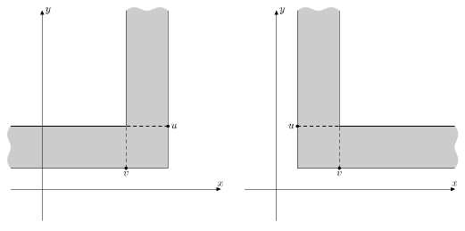

<h1 style='text-align: center;'> D. Wizards and Roads</h1>

<h5 style='text-align: center;'>time limit per test: 3 seconds</h5>
<h5 style='text-align: center;'>memory limit per test: 256 megabytes</h5>

In some country live wizards. They love to build cities and roads.

The country used to have *k* cities, the *j*-th city (1 ≤ *j* ≤ *k*) was located at a point (*x**j*, *y**j*). It was decided to create another *n* - *k* cities. And the *i*-th one (*k* < *i* ≤ *n*) was created at a point with coordinates (*x**i*, *y**i*):

* *x**i* = (*a*·*x**i* - 1 + *b*) *mod* (109 + 9)
* *y**i* = (*c*·*y**i* - 1 + *d*) *mod* (109 + 9)

Here *a*, *b*, *c*, *d* are primes. Also, *a* ≠ *c*, *b* ≠ *d*.

After the construction of all *n* cities, the wizards have noticed something surprising. It turned out that for every two different cities *i* and *j*, *x**i* ≠ *x**j* and *y**i* ≠ *y**j* holds.

The cities are built, it's time to build roads! It was decided to use the most difficult (and, of course, the most powerful) spell for the construction of roads. Using this spell creates a road between the towns of *u*, *v* (*y**u* > *y**v*) if and only if for any city *w* which lies strictly inside the corner at the point *u*, *v* (see below), there is a city *s* that does not lie in the corner, which is located along the *x*-coordinate strictly between *w* and *u* and simultaneously *y**s* > *y**v*.

A corner on the points *p*2(*x*2, *y*2), *p*1(*x*1, *y*1) (*y*1 < *y*2) is the set of points (*x*, *y*), for which at least one of the two conditions is fulfilled: 

* *min*(*x*1, *x*2) ≤ *x* ≤ *max*(*x*1, *x*2) and *y* ≥ *y*1
* *y*1 ≤ *y* ≤ *y*2 and (*x* - *x*2)·(*x*1 - *x*2) ≥ 0

   The pictures showing two different corners  In order to test the spell, the wizards will apply it to all the cities that lie on the *x*-coordinate in the interval [*L*, *R*]. After the construction of roads the national government wants to choose the maximum number of pairs of cities connected by the road, so that no city occurs in two or more pairs. Your task is for each *m* offered variants of values *L*, *R* to calculate the maximum number of such pairs after the construction of the roads. Please note that the cities that do not lie in the interval [*L*, *R*] on the *x*-coordinate, do not affect the construction of roads in any way.

## Input

The first line contains two space-separated integers *n*, *k* (1 ≤ *k* ≤ *n* ≤ 105, *k* ≤ 30). Next *k* lines contain coordinates of the cities' location points from the first to the *k*-th one. The *j*-th line contains space-separated pair of integers *x**j*, *y**j* (0 ≤ *x**j*, *y**j* < 109 + 9) — coordinates of the *j*-th city.

The next line contains space-separated integers *a*, *b*, *c*, *d* (2 ≤ *a*, *b*, *c*, *d* < 109 + 9). It is guaranteed that those numbers are prime and also that *a* ≠ *c*, *b* ≠ *d*. 

It's guaranteed, that for every two different cities *i* and *j*, *x**i* ≠ *x**j* and *y**i* ≠ *y**j* holds.

The next line contains integer *m* (1 ≤ *m* ≤ 105) — the number of variants to build the roads. Next *m* lines contain pairs of space-separated integers *L**i*, *R**i* (0 ≤ *L**i* ≤ *R**i* < 109 + 9) — the variants of choosing the cities to build the roads.

## Output

For any pair of numbers *L**i*, *R**i* print the answer to the problem on a single line. Print the answers for the pairs in the order, in which the pairs are given in the input data.

## Examples

## Input


```
6 6  
0 0  
1 1  
2 2  
3 3  
4 4  
5 5  
2 3 3 2  
4  
0 5  
1 4  
2 3  
3 3  

```
## Output


```
3  
2  
1  
0  

```
## Input


```
6 1  
0 0  
3 5 23917 11  
4  
0 1000000008  
0 10  
100 150  
200 10000  

```
## Output


```
2  
1  
0  
1  

```
## Note

In the first sample the roads connect the cities in a chain in the order of increasing of *x*. 

In the second sample the remaining 5 cities will be located at points (5,  11); (20,  263098); (65,  292514823); (200,  76958738); (605,  622120197).


#### tags 

#3000 #data_structures #divide_and_conquer #graph_matchings #graphs #greedy 