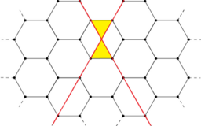
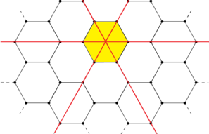

<h1 style='text-align: center;'> D. Very Suspicious</h1>

<h5 style='text-align: center;'>time limit per test: 1 second</h5>
<h5 style='text-align: center;'>memory limit per test: 256 megabytes</h5>

Sehr Sus is an infinite hexagonal grid as pictured below, controlled by MennaFadali, ZerooCool and Hosssam.

They love equilateral triangles and want to create $n$ equilateral triangles on the grid by adding some straight lines. The triangles must all be empty from the inside (in other words, no straight line or hexagon edge should pass through any of the triangles).

You are allowed to add straight lines parallel to the edges of the hexagons. Given $n$, what is the minimum number of lines you need to add to create at least $n$ equilateral triangles as described?

  Adding two red lines results in two new yellow equilateral triangles. ## Input

The first line contains a single integer $t$ ($1 \le t \le 10^5$) — the number of test cases. Then $t$ test cases follow.

Each test case contains a single integer $n$ ($1 \le n \le 10^{9}$) — the required number of equilateral triangles.

## Output

For each test case, print the minimum number of lines needed to have $n$ or more equilateral triangles.

## Example

## Input


```

41234567
```
## Output


```

2
2
3
83

```
## Note

In the first and second test cases only 2 lines are needed. After adding the first line, no equilateral triangles will be created no matter where it is added. But after adding the second line, two more triangles will be created at once. 

  In the third test case, the minimum needed is 3 lines as shown below.

  

#### tags 

#1700 #binary_search #brute_force #geometry #greedy #implementation #math 