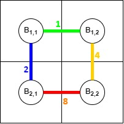

<h1 style='text-align: center;'> F. Anti-Theft Road Planning</h1>

<h5 style='text-align: center;'>time limit per test: 2 seconds</h5>
<h5 style='text-align: center;'>memory limit per test: 256 megabytes</h5>

This is an interactive problem.

A city has $n^2$ buildings divided into a grid of $n$ rows and $n$ columns. You need to build a road of some length $D(A,B)$ of your choice between each pair of adjacent by side buildings $A$ and $B$. Due to budget limitations and legal restrictions, the length of each road must be a positive integer and the total length of all roads should not exceed $48\,000$.

There is a thief in the city who will start from the topmost, leftmost building (in the first row and the first column) and roam around the city, occasionally stealing artifacts from some of the buildings. He can move from one building to another adjacent building by travelling through the road which connects them.

You are unable to track down what buildings he visits and what path he follows to reach them. But there is one tracking mechanism in the city. The tracker is capable of storing a single integer $x$ which is initially $0$. Each time the thief travels from a building $A$ to another adjacent building $B$ through a road of length $D(A,B)$, the tracker changes $x$ to $x\oplus D(A,B)$. Each time the thief steals from a building, the tracker reports the value $x$ stored in it and resets it back to $0$.

It is known beforehand that the thief will steal in exactly $k$ buildings but you will know the values returned by the tracker only after the thefts actually happen. Your task is to choose the lengths of roads in such a way that no matter what strategy or routes the thief follows, you will be able to exactly tell the location of all the buildings where the thefts occurred from the values returned by the tracker.

## Interaction

First read a single line containing two integers $n$ $(2\leq n\leq 32)$ and $k$ $(1\leq k\leq 1024)$ denoting the number of rows and number of thefts respectively.

Let's denote the $j$-th building in the $i$-th row by $B_{i,j}$.

Then print $n$ lines each containing $n-1$ integers. The $j$-th integer of the $i$-th line must be the value of $D(B_{i,j},B_{i,j+1})$.

Then print $n-1$ lines each containing $n$ integers. The $j$-th integer of the $i$-th line must be the value of $D(B_{i,j},B_{i+1,j})$.

Remember that the total length of the roads must not exceed $48\,000$.

Then answer $k$ queries. First read the value $x$ returned by the tracker. Then print two integers denoting the row number and column number of the building where the theft occurred. After that you will be able to answer the next query (if such exists).

After printing the answers do not forget to output end of line and flush the output buffer. Otherwise you will get the verdict Idleness limit exceeded. To flush the buffer, use:

* fflush(stdout) or cout.flush() in C++;
* System.out.flush() in Java;
* flush(output) in Pascal;
* stdout.flush() in Python;
* Read documentation for other languages.

Hacks

You cannot make hacks in this problem.

## Example

Input
```

2 4


14

1

14

3


```
Output
```


1
8
2 4

1 2

1 1

1 2

2 1

```
## Note

For the sample test, $n=2$ and $k=4$.

You choose to build the roads of the following lengths:

  The thief follows the following strategy: 

1. Start at $B_{1,1}$.
2. Move Right to $B_{1,2}$.
3. Move Down to $B_{2,2}$.
4. Move Left to $B_{2,1}$.
5. Move Up to $B_{1,1}$.
6. Move Right to $B_{1,2}$.
7. Steal from $B_{1,2}$.
8. Move Left to $B_{1,1}$.
9. Steal from $B_{1,1}$.
10. Move Down to $B_{2,1}$.
11. Move Right to $B_{2,2}$.
12. Move Up to $B_{1,2}$.
13. Steal from $B_{1,2}$.
14. Move Left to $B_{1,1}$.
15. Move Down to $B_{2,1}$.
16. Steal from $B_{2,1}$.

The tracker responds in the following way: 

1. Initialize $x=0$.
2. Change $x$ to $x\oplus 1=0\oplus1=1$.
3. Change $x$ to $x\oplus 4=1\oplus4=5$.
4. Change $x$ to $x\oplus 8=5\oplus8=13$.
5. Change $x$ to $x\oplus 2=13\oplus2=15$.
6. Change $x$ to $x\oplus 1=15\oplus1=14$.
7. Return $x=14$ and re-initialize $x=0$.
8. Change $x$ to $x\oplus 1=0\oplus1=1$.
9. Return $x=1$ and re-initialize $x=0$.
10. Change $x$ to $x\oplus 2=0\oplus2=2$.
11. Change $x$ to $x\oplus 8=2\oplus8=10$.
12. Change $x$ to $x\oplus 4=10\oplus4=14$.
13. Return $x=14$ and re-initialize $x=0$.
14. Change $x$ to $x\oplus 1=0\oplus1=1$.
15. Change $x$ to $x\oplus 2=1\oplus2=3$.
16. Return $x=3$ and re-initialize $x=0$.


#### tags 

#2400 #bitmasks #constructive_algorithms #divide_and_conquer #greedy #interactive #math 