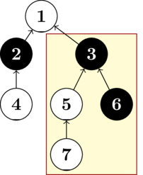

<h1 style='text-align: center;'> G. White-Black Balanced Subtrees</h1>

<h5 style='text-align: center;'>time limit per test: 1 second</h5>
<h5 style='text-align: center;'>memory limit per test: 256 megabytes</h5>

You are given a rooted tree consisting of $n$ vertices numbered from $1$ to $n$. The root is vertex $1$. There is also a string $s$ denoting the color of each vertex: if $s_i = \texttt{B}$, then vertex $i$ is black, and if $s_i = \texttt{W}$, then vertex $i$ is white.

A subtree of the tree is called balanced if the number of white vertices equals the number of black vertices. Count the number of balanced subtrees.

A tree is a connected undirected graph without cycles. A rooted tree is a tree with a selected vertex, which is called the root. In this problem, all trees have root $1$.

The tree is specified by an array of parents $a_2, \dots, a_n$ containing $n-1$ numbers: $a_i$ is the parent of the vertex with the number $i$ for all $i = 2, \dots, n$. The parent of a vertex $u$ is a vertex that is the next vertex on a simple path from $u$ to the root.

The subtree of a vertex $u$ is the set of all vertices that pass through $u$ on a simple path to the root. For example, in the picture below, $7$ is in the subtree of $3$ because the simple path $7 \to 5 \to 3 \to 1$ passes through $3$. ## Note

 that a vertex is included in its subtree, and the subtree of the root is the entire tree.

  The picture shows the tree for $n=7$, $a=[1,1,2,3,3,5]$, and $s=\texttt{WBBWWBW}$. The subtree at the vertex $3$ is balanced. ## Input

The first line of input contains an integer $t$ ($1 \le t \le 10^4$) — the number of test cases.

The first line of each test case contains an integer $n$ ($2 \le n \le 4000$) — the number of vertices in the tree.

The second line of each test case contains $n-1$ integers $a_2, \dots, a_n$ ($1 \le a_i < i$) — the parents of the vertices $2, \dots, n$.

The third line of each test case contains a string $s$ of length $n$ consisting of the characters $\texttt{B}$ and $\texttt{W}$ — the coloring of the tree.

It is guaranteed that the sum of the values $n$ over all test cases does not exceed $2 \cdot 10^5$.

## Output

For each test case, output a single integer — the number of balanced subtrees.

## Example

## Input


```

371 1 2 3 3 5WBBWWBW21BW81 2 3 4 5 6 7BWBWBWBW
```
## Output


```

2
1
4

```
## Note

The first test case is pictured in the statement. Only the subtrees at vertices $2$ and $3$ are balanced.

In the second test case, only the subtree at vertex $1$ is balanced.

In the third test case, only the subtrees at vertices $1$, $3$, $5$, and $7$ are balanced.


#### tags 

#1300 #dfs_and_similar #dp #graphs #trees 