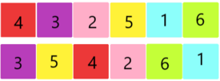
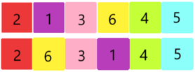

<h1 style='text-align: center;'> C. Tokitsukaze and Two Colorful Tapes</h1>

<h5 style='text-align: center;'>time limit per test: 2 seconds</h5>
<h5 style='text-align: center;'>memory limit per test: 256 megabytes</h5>

Tokitsukaze has two colorful tapes. There are $n$ distinct colors, numbered $1$ through $n$, and each color appears exactly once on each of the two tapes. Denote the color of the $i$-th position of the first tape as $ca_i$, and the color of the $i$-th position of the second tape as $cb_i$.

Now Tokitsukaze wants to select each color an integer value from $1$ to $n$, distinct for all the colors. After that she will put down the color values in each colored position on the tapes. Denote the number of the $i$-th position of the first tape as $numa_i$, and the number of the $i$-th position of the second tape as $numb_i$.

  For example, for the above picture, assuming that the color red has value $x$ ($1 \leq x \leq n$), it appears at the $1$-st position of the first tape and the $3$-rd position of the second tape, so $numa_1=numb_3=x$.

## Note

 that each color $i$ from $1$ to $n$ should have a distinct value, and the same color which appears in both tapes has the same value. 

After labeling each color, the beauty of the two tapes is calculated as $$\sum_{i=1}^{n}|numa_i-numb_i|.$$

Please help Tokitsukaze to find the highest possible beauty. 

## Input

The first contains a single positive integer $t$ ($1 \leq t \leq 10^4$) — the number of test cases.

For each test case, the first line contains a single integer $n$ ($1\leq n \leq 10^5$) — the number of colors.

The second line contains $n$ integers $ca_1, ca_2, \ldots, ca_n$ ($1 \leq ca_i \leq n$) — the color of each position of the first tape. It is guaranteed that $ca$ is a permutation.

The third line contains $n$ integers $cb_1, cb_2, \ldots, cb_n$ ($1 \leq cb_i \leq n$) — the color of each position of the second tape. It is guaranteed that $cb$ is a permutation.

It is guaranteed that the sum of $n$ over all test cases does not exceed $2 \cdot 10^{5}$.

## Output

For each test case, print a single integer — the highest possible beauty.

## Example

## Input


```

361 5 4 3 2 65 3 1 4 6 263 5 4 6 2 13 6 4 5 2 1111
```
## Output


```

18
10
0

```
## Note

An optimal solution for the first test case is shown in the following figure:

  The beauty is $\left|4-3 \right|+\left|3-5 \right|+\left|2-4 \right|+\left|5-2 \right|+\left|1-6 \right|+\left|6-1 \right|=18$.

An optimal solution for the second test case is shown in the following figure:

  The beauty is $\left|2-2 \right|+\left|1-6 \right|+\left|3-3 \right|+\left|6-1 \right|+\left|4-4 \right|+\left|5-5 \right|=10$.


#### tags 

#1900 #constructive_algorithms #dfs_and_similar #graphs #greedy 