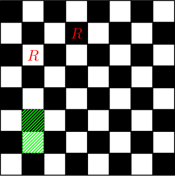
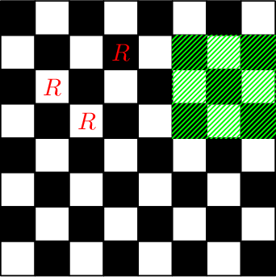
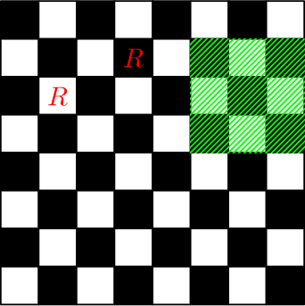
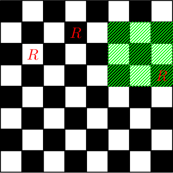

<h1 style='text-align: center;'> C. Rooks Defenders</h1>

<h5 style='text-align: center;'>time limit per test: 1 second</h5>
<h5 style='text-align: center;'>memory limit per test: 256 megabytes</h5>

You have a square chessboard of size $n \times n$. Rows are numbered from top to bottom with numbers from $1$ to $n$, and columns — from left to right with numbers from $1$ to $n$. So, each cell is denoted with pair of integers $(x, y)$ ($1 \le x, y \le n$), where $x$ is a row number and $y$ is a column number.

You have to perform $q$ queries of three types:

* Put a new rook in cell $(x, y)$.
* Remove a rook from cell $(x, y)$. It's guaranteed that the rook was put in this cell before.
* Check if each cell of subrectangle $(x_1, y_1) - (x_2, y_2)$ of the board is attacked by at least one rook.

Subrectangle is a set of cells $(x, y)$ such that for each cell two conditions are satisfied: $x_1 \le x \le x_2$ and $y_1 \le y \le y_2$.

Recall that cell $(a, b)$ is attacked by a rook placed in cell $(c, d)$ if either $a = c$ or $b = d$. In particular, the cell containing a rook is attacked by this rook.

## Input

The first line contains two integers $n$ and $q$ ($1 \le n \le 10^5$, $1 \le q \le 2 \cdot 10^5$) — the size of the chessboard and the number of queries, respectively.

Each of the following $q$ lines contains description of a query. Description begins with integer $t$ ($t \in \{1, 2, 3\}$) which denotes type of a query:

* If $t = 1$, two integers $x$ and $y$ follows ($1 \le x, y \le n$) — coordinated of the cell where the new rook should be put in. It's guaranteed that there is no rook in the cell $(x, y)$ at the moment of the given query.
* If $t = 2$, two integers $x$ and $y$ follows ($1 \le x, y \le n$) — coordinates of the cell to remove a rook from. It's guaranteed that there is a rook in the cell $(x, y)$ at the moment of the given query.
* If $t = 3$, four integers $x_1, y_1, x_2$ and $y_2$ follows ($1 \le x_1 \le x_2 \le n$, $1 \le y_1 \le y_2 \le n$) — subrectangle to check if each cell of it is attacked by at least one rook.

It's guaranteed that among $q$ queries there is at least one query of the third type.

## Output

Print the answer for each query of the third type in a separate line. Print "Yes" (without quotes) if each cell of the subrectangle is attacked by at least one rook.

Otherwise print "No" (without quotes).

## Example

## Input


```

8 10
1 2 4
3 6 2 7 2
1 3 2
3 6 2 7 2
1 4 3
3 2 6 4 8
2 4 3
3 2 6 4 8
1 4 8
3 2 6 4 8

```
## Output


```

No
Yes
Yes
No
Yes

```
## Note

Consider example. After the first two queries the board will look like the following picture (the letter $R$ denotes cells in which rooks are located, the subrectangle of the query of the third type is highlighted in green):

  Chessboard after performing the third and the fourth queries:

  Chessboard after performing the fifth and the sixth queries:

  Chessboard after performing the seventh and the eighth queries:

  Chessboard after performing the last two queries:

  

#### tags 

#1400 #data_structures #implementation 