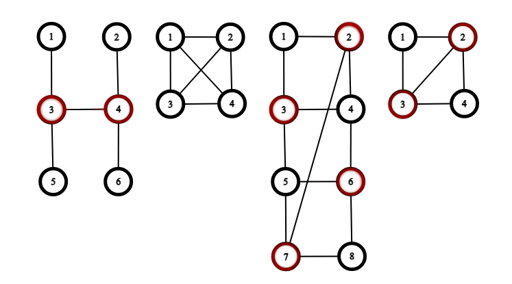

<h1 style='text-align: center;'> F. Lenient Vertex Cover</h1>

<h5 style='text-align: center;'>time limit per test: 5 seconds</h5>
<h5 style='text-align: center;'>memory limit per test: 512 megabytes</h5>

You are given a simple connected undirected graph, consisting of $n$ vertices and $m$ edges. The vertices are numbered from $1$ to $n$.

A vertex cover of a graph is a set of vertices such that each edge has at least one of its endpoints in the set.

Let's call a lenient vertex cover such a vertex cover that at most one edge in it has both endpoints in the set.

Find a lenient vertex cover of a graph or report that there is none. If there are multiple answers, then print any of them.

## Input

The first line contains a single integer $t$ ($1 \le t \le 10^4$) — the number of testcases.

The first line of each testcase contains two integers $n$ and $m$ ($2 \le n \le 10^6$; $n - 1 \le m \le \min(10^6, \frac{n \cdot (n - 1)}{2})$) — the number of vertices and the number of edges of the graph.

Each of the next $m$ lines contains two integers $v$ and $u$ ($1 \le v, u \le n$; $v \neq u$) — the descriptions of the edges.

For each testcase, the graph is connected and doesn't have multiple edges. The sum of $n$ over all testcases doesn't exceed $10^6$. The sum of $m$ over all testcases doesn't exceed $10^6$.

## Output

For each testcase, the first line should contain YES if a lenient vertex cover exists, and NO otherwise. If it exists, the second line should contain a binary string $s$ of length $n$, where $s_i = 1$ means that vertex $i$ is in the vertex cover, and $s_i = 0$ means that vertex $i$ isn't.

If there are multiple answers, then print any of them.

## Examples

## Input


```

46 51 32 43 43 54 64 61 22 33 41 41 32 48 111 32 43 54 65 76 81 23 45 67 87 24 51 22 33 41 32 4
```
## Output


```

YES
001100
NO
YES
01100110
YES
0110

```
## Input


```

110 159 43 46 41 28 28 37 29 57 85 101 42 105 35 72 9
```
## Output


```

YES
0101100100

```
## Input


```

110 197 95 33 41 69 41 410 57 19 28 37 310 92 109 83 21 510 79 51 2
```
## Output


```

YES
1010000011

```
## Note

Here are the graphs from the first example. The vertices in the lenient vertex covers are marked red. 

  

#### tags 

#2600 #dfs_and_similar #divide_and_conquer #dsu #graphs #trees 