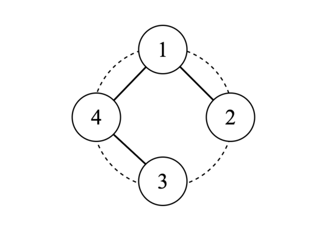
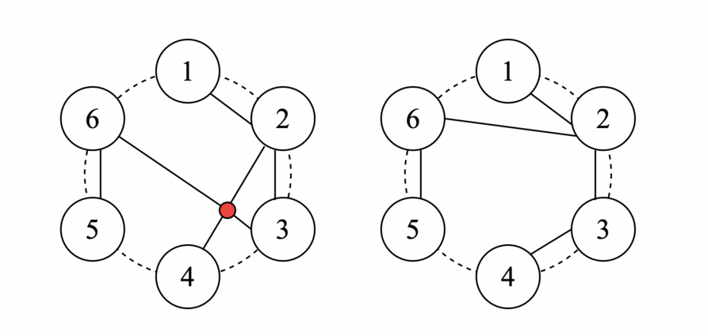

<h1 style='text-align: center;'> D. Circular Spanning Tree</h1>

<h5 style='text-align: center;'>time limit per test: 1 second</h5>
<h5 style='text-align: center;'>memory limit per test: 256 megabytes</h5>

There are $n$ nodes arranged in a circle numbered from $1$ to $n$ in the clockwise order. You are also given a binary string $s$ of length $n$.

Your task is to construct a tree on the given $n$ nodes satisfying the two conditions below or report that there such tree does not exist:

* For each node $i$ $(1 \le i \le n)$, the degree of node is even if $s_i = 0$ and odd if $s_i = 1$.
* No two edges of the tree intersect internally in the circle. The edges are allowed to intersect on the circumference.

 ## Note

 that all edges are drawn as straight line segments. For example, edge $(u, v)$ in the tree is drawn as a line segment connecting $u$ and $v$ on the circle.

A tree on $n$ nodes is a connected graph with $n - 1$ edges.

## Input

The input consists of multiple test cases. The first line contains a single integer $t$ $(1 \leq t \leq 2\cdot 10^4)$  — the number of test cases. Description of the test cases follows.

The first line of each test case contains a single integer $n$ $(2 \leq n \leq 2\cdot 10^5)$  — the number of nodes.

The second line of each test case contains a binary string $s$ of length $n$.

It is guaranteed that the sum of $n$ over all test cases does not exceed $2\cdot 10^5$.

## Output

For each test case, if there does not exist a tree that satisfies the given conditions, then output "NO" (without quotes), otherwise output "YES" followed by the description of tree.

You can output each letter in any case (for example, "YES", "Yes", "yes", "yEs", "yEs" will be recognized as a positive answer).

If there exists a tree, then output $n - 1$ lines, each containing two integers $u$ and $v$ $(1 \leq u,v \leq n, u \neq v)$ denoting an edge between $u$ and $v$ in the tree. If there are multiple possible answers, output any.

## Example

## Input


```

3401102106110110
```
## Output


```

YES
2 1
3 4
1 4
NO
YES
2 3
1 2
5 6
6 2
3 4

```
## Note

In the first test case, the tree looks as follows: 

  In the second test case, there is only one possible tree with an edge between $1$ and $2$, and it does not satisfy the degree constraints.

In the third test case, 

   The tree on the left satisfies the degree constraints but the edges intersect internally, therefore it is not a valid tree, while the tree on the right is valid.

#### tags 

#2000 #constructive_algorithms #implementation #trees 