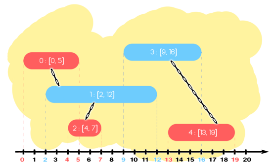

<h1 style='text-align: center;'> E. Number of Groups</h1>

<h5 style='text-align: center;'>time limit per test: 2 seconds</h5>
<h5 style='text-align: center;'>memory limit per test: 256 megabytes</h5>

You are given $n$ colored segments on the number line. Each segment is either colored red or blue. The $i$-th segment can be represented by a tuple $(c_i, l_i, r_i)$. The segment contains all the points in the range $[l_i, r_i]$, inclusive, and its color denoted by $c_i$: 

* if $c_i = 0$, it is a red segment;
* if $c_i = 1$, it is a blue segment.

We say that two segments of different colors are connected, if they share at least one common point. Two segments belong to the same group, if they are either connected directly, or through a sequence of directly connected segments. Find the number of groups of segments.

   ## Input

Each test contains multiple test cases. The first line contains the number of test cases $t$ ($1 \le t \le 10^5$). Description of the test cases follows.

The first line of each test case contains a single integer $n$ ($1 \leq n \leq 10^5$) — the number of segments. 

Each of the next $n$ lines contains three integers $c_i, l_i, r_i$ ($0 \leq c_i \leq 1, 0 \leq l_i \leq r_i \leq 10^9$), describing the $i$-th segment. 

It is guaranteed that the sum of $n$ over all test cases does not exceed $10^5$.

## Output

For each test case, print a single integer $k$, the number of groups of segments.

## Example

## Input


```

250 0 51 2 120 4 71 9 160 13 1931 0 11 1 20 3 4
```
## Output


```

2
3

```
## Note

In the first example there are $5$ segments. The segments $1$ and $2$ are connected, because they are of different colors and share a point. Also, the segments $2$ and $3$ are connected, and so are segments $4$ and $5$. Thus, there are two groups: one containing segments $\{1, 2, 3\}$, and the other one containing segments $\{4, 5\}$.


#### tags 

#2300 #data_structures #dfs_and_similar #dsu #graphs #greedy #sortings 